# ZLend: Skills-Based Protocol Analysis

*Cross-referencing the ZLend design specification against 14 Ethereum development skills. Each section evaluates what ZLend gets right, what it gets wrong, what's missing, and what will break during implementation.*

---

## Table of Contents

1. [DeFi Building Blocks](#1-defi-building-blocks)
2. [Smart Contract Security](#2-smart-contract-security)
3. [Core Concepts — Incentive Design](#3-core-concepts--incentive-design)
4. [Contract Addresses & Aave V3 Reality](#4-contract-addresses--aave-v3-reality)
5. [Wallet Architecture & Key Management](#5-wallet-architecture--key-management)
6. [Token Standards & ERC-20 Design](#6-token-standards--erc-20-design)
7. [Onchain Data & Indexing](#7-onchain-data--indexing)
8. [Smart Contract Testing Strategy](#8-smart-contract-testing-strategy)
9. [Gas & Cost Analysis](#9-gas--cost-analysis)
10. [Development Tools & Stack](#10-development-tools--stack)
11. [Layer 2 & Chain Selection](#11-layer-2--chain-selection)
12. [Frontend UX](#12-frontend-ux)
13. [Chain Rationale — Why Avalanche?](#13-chain-rationale--why-avalanche)
14. [Cross-Skill Synthesis — The Verdict](#14-cross-skill-synthesis--the-verdict)

---

## 1. DeFi Building Blocks

*Skill: building-blocks — DeFi legos and protocol composability*

### What ZLend Claims

ZLend integrates with **Aave V3** on Avalanche C-Chain. The flow is:

```
ZLendContract → approval(addr, amount) → Aave V3
ZLendContract → supply(amount)          → Aave V3
ZLendContract → borrow(amount)          → Aave V3
ZLendContract → repay(amount)           → Aave V3
```

The contracts.md defines this as a direct integration with the "existing Aave V3 deployment on Avalanche — no fork required."

### What the DeFi Skill Reveals

**Problem 1: Collateral Bridging Is Fundamentally Unresolved**

Aave V3's `supply()` function expects ERC-20 tokens on the same chain. You deposit WETH, USDC, or wstETH — tokens that *exist on Avalanche* — and borrow against them. ZLend's collateral is ZEC on the Zcash chain. It doesn't exist on Avalanche at all.

The ZK proof proves the user *owns* ZEC on Zcash. But `ZLendContract.supply()` needs to deposit *something* into Aave's pool. The three realistic options:

| Option | Feasibility | Issue |
|--------|-------------|-------|
| Mint a synthetic "zkZEC" and supply to Aave | **Very Low** | Aave governance must list the token. No precedent for ZK-proof-backed synthetics in Aave. Listing process takes months and requires significant liquidity + oracle support. |
| Use ZLend as a standalone lending pool (no Aave) | **High** | ZLend manages its own supply/borrow accounting. Can reference Aave's interest rate model (IRM) without using Aave's contracts. This is what SparkLend does — forked Aave, independent pool. |
| Bridge ZEC to Avalanche via a real bridge, then supply | **Medium** | Defeats the privacy purpose. Bridged ZEC on Avalanche is publicly visible, directly linkable to the bridge transaction. |

**Verdict**: ZLend almost certainly needs to operate as a **standalone lending pool**, not an Aave V3 wrapper. The docs reference [SparkLend's Pool#supply](https://docs.spark.fi/dev/sparklend/core-contracts/pool#supply) as inspiration — this is the right model. SparkLend forked Aave's contracts to run independently. ZLend should do the same: use Aave's IRM (interest rate model) math, but manage its own pool state.

This is the single most important architectural decision. Every contract, every flow, every test depends on it.

**Problem 2: Flash Loan Attack Surface**

If ZLend runs its own pool, it inherits the flash loan attack surface from DeFi composability. An attacker could:

1. Flash-borrow from Aave to manipulate ZEC price on a DEX
2. Trigger liquidation on an undercollateralized ZLend position
3. Liquidate at a favorable price
4. Repay flash loan

The ZLend spec mentions oracle-based liquidation but doesn't specify the oracle source. Using a DEX spot price (e.g., Uniswap `getReserves()`) for ZEC/USD would be **catastrophically vulnerable** to flash loan manipulation. Chainlink is the minimum viable oracle for any lending protocol.

**Problem 3: No ERC-4626 Vault Pattern**

The DeFi skill identifies ERC-4626 as "the ERC-20 of yield." If ZLend manages its own pool, depositors (lenders who supply the ERC-20 tokens that borrowers receive) should get ERC-4626 vault shares. The spec doesn't mention a supply-side at all — only the borrow-side flow. Who provides the ERC-20 tokens that borrowers receive? This is not specified.

### Recommendations

1. **Abandon the Aave V3 wrapper model.** Build a standalone pool inspired by SparkLend/Aave's architecture.
2. **Design the supply-side.** Who deposits ERC-20 tokens into the pool? What do they earn? How are they compensated for the risk of ZEC collateral volatility?
3. **Use Chainlink for ZEC/USD price feeds.** Never DEX spot prices.
4. **Implement ERC-4626 for pool shares** if there's a supply-side.
5. **Add flash loan protection** — at minimum, a `nonReentrant` guard on all state-changing functions, plus Chainlink TWAP for price decisions.

---

## 2. Smart Contract Security

*Skill: security — Solidity security patterns, common vulnerabilities, pre-deploy audit checklist*

### Vulnerabilities the ZLend Design Introduces

**Vulnerability 1: Reentrancy on borrow()**

The borrow flow is: verify proof → supply to pool → borrow from pool → transfer ERC-20 to user. The `transfer` at the end is an external call. If `ProtoSocolo` or the ERC-20 token has a callback (ERC-777 or similar), the user could re-enter `borrow()` before state updates complete.

```solidity
// VULNERABLE PATTERN (implied by ZLend's flow)
function borrow(bytes calldata proof, uint256 amount) external {
    require(verifier.verify(proof), "Invalid proof");
    // State not yet updated...
    pool.supply(amount);
    pool.borrow(amount);
    token.transfer(msg.sender, amount);  // ← External call BEFORE state update
    // Position state updated here — too late
}
```

**Fix**: Checks-Effects-Interactions (CEI) + `nonReentrant`:

```solidity
function borrow(bytes calldata proof, uint256 amount) external nonReentrant {
    require(verifier.verify(proof), "Invalid proof");
    positions[msg.sender].debt += amount;  // Effect BEFORE interaction
    pool.supply(amount);
    pool.borrow(amount);
    token.safeTransfer(msg.sender, amount);  // Interaction LAST
}
```

**Vulnerability 2: Nullifier Replay**

The spec identifies replay attacks as "Critical — must be resolved before deployment" but doesn't commit to a nullifier implementation. The security implications:

- Without a nullifier registry, a user could submit the same ZK proof multiple times to borrow against the same collateral repeatedly
- The nullifier must be stored on-chain (mapping or Merkle tree) and checked before every borrow
- Each nullifier must be unique per borrow cycle, not per UTXO

```solidity
// Required pattern
mapping(bytes32 => bool) public usedNullifiers;

function borrow(bytes calldata proof, uint256 amount) external nonReentrant {
    bytes32 nullifier = extractNullifier(proof);
    require(!usedNullifiers[nullifier], "Nullifier already used");
    usedNullifiers[nullifier] = true;  // Mark before external calls
    // ... rest of borrow logic
}
```

**Vulnerability 3: SafeERC20 Not Mentioned**

The spec describes ERC-20 transfers but never mentions `SafeERC20`. If `ProtoSocolo` or any integrated token (USDT, USDC) doesn't return `bool` on `transfer()`, standard calls will silently fail.

**Mandatory**: Use OpenZeppelin's `SafeERC20` for ALL token operations:

```solidity
using SafeERC20 for IERC20;
token.safeTransfer(to, amount);
token.safeApprove(spender, amount);
```

**Vulnerability 4: Token Decimal Assumptions**

The spec doesn't address token decimals anywhere. USDC has 6 decimals, not 18. If the borrow amount is internally tracked with 18-decimal math but the borrowed token has 6 decimals, the user gets 1 trillion times more tokens than intended.

```solidity
// WRONG — assumes 18 decimals
uint256 oneToken = 1e18;

// CORRECT — check decimals
uint256 oneToken = 10 ** IERC20Metadata(token).decimals();
```

**Vulnerability 5: Missing Access Control**

The `IZLendContract` interface has no access control. Who can call `supplyTransfer`? Anyone? Only the relayer? Only addresses with valid proofs? The interface doesn't specify `onlyOwner`, role-based access, or any permission model.

At minimum:
- `connectVk`: Should be permissioned (only the position owner or relayer)
- `withdrawProof`: Should verify the caller owns the position
- Emergency functions (pause, admin withdrawal): Need explicit `onlyOwner` with timelocks

### Security Checklist Applied to ZLend

- [ ] **Access control** — Not specified for any function
- [ ] **Reentrancy protection** — Not mentioned in spec
- [ ] **Token decimal handling** — Not addressed
- [ ] **Oracle safety** — Oracle source not specified
- [ ] **Integer math** — No discussion of precision/rounding
- [ ] **Return values checked** — SafeERC20 not mentioned
- [ ] **Input validation** — No zero-address/zero-amount checks specified
- [ ] **Events emitted** — Only `FinishPayment` defined; supply, borrow, repay events missing
- [ ] **Nullifier registry** — Approach identified but not implemented
- [ ] **No infinite approvals** — Not discussed
- [ ] **Proxy upgradeability** — Not discussed (will the contract be upgradeable?)

**Verdict**: The security posture is spec-level, not implementation-level. Every item above must be addressed during implementation. This is normal for a design doc — but the team should use this checklist as the baseline for contract development.

---

## 3. Core Concepts — Incentive Design

*Skill: concepts — "Nothing is automatic" and incentive design*

### The Critical Question ZLend Doesn't Answer

**"Who pokes the contract?"**

The concepts skill states: *"For EVERY state transition in your system, you must answer: (1) Who pokes it? (2) Why would they? (3) Is the incentive sufficient?"*

Let's apply this to ZLend's state transitions:

| State Transition | Who Pokes It? | Why? | Incentive Sufficient? |
|------------------|---------------|------|----------------------|
| `supplyTransfer` | User | They want to borrow | Yes — self-interested |
| `borrow` | User (via relayer) | They want tokens | Yes — self-interested |
| `repay` | User | They want collateral back | Yes — self-interested |
| `withdrawProof` | User | They want collateral released | Yes — self-interested |
| **Liquidation** | **???** | **???** | **Not specified** |
| **Solvency proof refresh** | **User (timeout-based)** | **Avoid liquidation** | **Partially — coercion, not reward** |
| **Price oracle update** | **???** | **???** | **Not specified** |

**Liquidation is the most critical missing incentive.** In Aave and Compound, liquidation is **permissionless** — ANYONE can call `liquidate()` and earn a 5-10% bonus on the collateral. This creates a self-sustaining system: thousands of bots compete to liquidate unhealthy positions, keeping the protocol solvent without any operator.

ZLend's liquidation section describes three approaches (oracle-based, proof-based, timeout-based) but doesn't specify:

1. Who calls the liquidation function?
2. What do they earn for doing it?
3. How do they know a position is liquidatable if collateral amounts are private?

**The privacy-liquidation paradox**: In Aave, liquidators can see every position's health factor. In ZLend, collateral amounts are hidden. How does a liquidator know *which* position to liquidate? The spec mentions "the protocol reveals the minimum collateral information needed for liquidation (via viewing key)" — but who triggers this reveal? The viewing key is held by the relayer — does the relayer run the liquidation bot?

If the relayer is the only entity that can see positions, then:
- The relayer IS the liquidator (centralization risk)
- Or the relayer publishes liquidation opportunities (metadata leak)
- Or positions self-report via solvency proofs (coercion-based, not incentive-based)

**Recommendation**: Design liquidation as a **permissionless incentivized action**. Consider:
- Publish a commitment to the health factor (hidden amount, but public "healthy/unhealthy" bit)
- Liquidators earn a discount on collateral (standard DeFi model)
- The relayer can trigger liquidation but isn't the only one who can
- Fallback: timeout-based auto-liquidation if no one acts within N blocks

### The Hyperstructure Test

*"Could ZLend run forever with no team behind it?"*

**No.** ZLend depends on:
- A relayer that must be operated (could be decentralized, but isn't specified)
- Price oracle updates (who runs the oracle?)
- Liquidation execution (who runs the bots?)
- Zcash chain scanning (who runs lightwalletd?)

This isn't necessarily bad — many DeFi protocols depend on operated infrastructure. But the team should be explicit about which components are decentralizable and which are permanently operated. The current spec hand-waves this.

---

## 4. Contract Addresses & Aave V3 Reality

*Skill: addresses — Verified contract addresses for major protocols*

### Aave V3 on Avalanche — What Actually Exists

The ZLend spec says "existing Aave V3 deployment on Avalanche" but doesn't provide addresses. Here's what's actually deployed:

**Aave V3 is deployed on Avalanche C-Chain.** The addresses skill confirms Aave V3 across multiple chains. For Avalanche specifically, the contracts exist — but ZLend's interaction model has a fundamental problem (see Section 1).

**Key insight from the addresses skill**: The Aave V3 `Pool` contract is the same interface everywhere:
- `supply(address asset, uint256 amount, address onBehalfOf, uint16 referralCode)`
- `borrow(address asset, uint256 amount, uint256 interestRateMode, uint16 referralCode, address onBehalfOf)`

The `asset` parameter requires a **deployed ERC-20 on Avalanche**. ZEC on Zcash is not an ERC-20 on Avalanche. This confirms the bridging gap is real.

### Chainlink Price Feeds

ZLend needs a ZEC/USD price feed for collateralization ratio checks. Chainlink provides:

- ETH/USD feeds on all major chains (verified)
- ZEC/USD may or may not be available on Avalanche — **this needs verification**

If no Chainlink ZEC/USD feed exists on Avalanche, ZLend must either:
1. Use a TWAP from a DEX (dangerous — see security section)
2. Deploy a custom oracle
3. Use a cross-chain oracle bridge

**Action item**: Verify Chainlink ZEC/USD feed availability on Avalanche C-Chain before any contract design proceeds.

---

## 5. Wallet Architecture & Key Management

*Skill: wallets — EOAs, smart wallets, key handling, FROST parallels*

### ZLend's Key Management vs. Industry Standards

ZLend's FROST 2-of-3 threshold key management is **more sophisticated than standard Ethereum wallet patterns** but follows the same trust principles:

| ZLend Pattern | Ethereum Equivalent | Assessment |
|---------------|---------------------|------------|
| User holds 2-of-3 FROST shares | EOA with full control | User has full sovereignty |
| Relayer holds 1-of-3 | Safe guardian / co-signer | Can enforce policy, can't act alone |
| Backup in cold storage | Hardware wallet recovery | Standard recovery pattern |
| `ask` never reconstructed | Smart wallet (no single key exposure) | Superior to raw Shamir |

The wallets skill's **Safe 1-of-2 pattern for AI agents** directly parallels ZLend's relayer model:

```
Safe Pattern:                    ZLend Pattern:
- Owner 1: Agent (hot, auto)     - Shares 1+2: User (hot, browser)
- Owner 2: Human (cold, recover) - Share 3: Relayer (operated, policy)
- Threshold: 1                   - Threshold: 2
```

Both models give the primary operator unilateral capability while retaining a recovery path.

### Key Safety Rules Applied to ZLend

The wallets skill states: **"NEVER extract a private key from any wallet without explicit human permission."**

ZLend's design respects this — `sk` never leaves the browser. But the FROST DKG ceremony creates a vulnerability window:

1. `sk` is used to derive `ask`
2. `ask` is split into shares
3. `sk` is "destroyed"

**During step 1-2, the full `ask` exists in browser memory.** This is a ~100ms window, but:
- JavaScript garbage collection is non-deterministic — the key may linger in memory
- Browser extensions can read page memory
- Memory dumps capture everything

**Mitigation**: Run FROST DKG inside a Web Worker or, ideally, inside a WebAssembly module where JavaScript can't directly access the memory. WebZjs (WASM) already provides the right execution context — the DKG should run entirely within the WASM boundary, with shares exported individually.

### EIP-7702 Relevance

EIP-7702 (Smart EOAs, live since May 2025) could simplify ZLend's Avalanche-side interactions. A user's EOA could temporarily delegate to a ZLend contract for batch operations:

```
Without EIP-7702:
  1. approve(ZLendContract, amount)    ← separate tx
  2. supplyTransfer(amount, utk)       ← separate tx
  3. connectVk(vk)                     ← separate tx

With EIP-7702:
  1. EOA delegates to ZLendBatcher     ← one tx
     → approve + supply + connectVk    ← all in one
```

This reduces gas costs and UX friction. Worth considering for the Avalanche-side implementation.

---

## 6. Token Standards & ERC-20 Design

*Skill: standards — ERC-20, ERC-4626, ERC-2612, x402*

### ProtoSocolo (ERC-20) Analysis

The spec describes ProtoSocolo as "an ERC-20 token contract used for internal transfers within the ZLend protocol." This is vague. Questions:

1. **Is ProtoSocolo a new token?** Or a wrapper around an existing ERC-20 (USDC, WAVAX)?
2. **Who mints ProtoSocolo tokens?** The ZLendContract? On what backing?
3. **Is it transferable?** Or is it a receipt token (non-transferable)?
4. **Does it implement ERC-2612 (Permit)?** This would enable gasless approvals — important for privacy (fewer on-chain transactions = smaller metadata footprint).

**If ZLend runs its own pool**, ProtoSocolo could be the **pool share token** (like Aave's aTokens). In that case, it should implement **ERC-4626** (standardized vault interface):

```solidity
// ProtoSocolo as ERC-4626 vault share
contract ProtoSocolo is ERC4626 {
    constructor(IERC20 asset_)
        ERC4626(asset_)
        ERC20("ZLend Pool Share", "pZLEND")
    {}

    function totalAssets() public view override returns (uint256) {
        return IERC20(asset()).balanceOf(address(this)) + totalBorrowed;
    }
}
```

**If ProtoSocolo is just a transfer intermediary**, it may not need to be a separate contract at all — standard ERC-20 `transfer()` from ZLendContract suffices.

### ERC-2612 Permit for Privacy

The standards skill highlights **ERC-2612 (gasless approvals via Permit)**. This is highly relevant to ZLend's privacy model:

- Without Permit: The user must call `approve()` from their Avalanche address before the relayer can act on their behalf. This `approve()` transaction links the user's address to ZLendContract.
- With Permit: The user signs an off-chain message. The relayer submits the permit + borrow in a single transaction. The user's address never directly interacts with the contract.

**Recommendation**: ProtoSocolo (or whatever ERC-20 is used) should implement ERC-2612. The borrowed token should also support Permit if possible (USDC does on some chains).

### x402 and ERC-8004 — Future Relevance

The standards skill describes x402 (HTTP payments) and ERC-8004 (agent identity). These are **not immediately relevant** to ZLend's current design, but if ZLend's relayer evolves into a service that charges fees for privacy-preserving transaction submission, x402 could be the payment mechanism. Similarly, if the relayer becomes a registered agent with a reputation score, ERC-8004 provides the identity layer.

These are v3+ considerations. Note them but don't build for them now.

---

## 7. Onchain Data & Indexing

*Skill: indexing — Events, The Graph, onchain data reading*

### ZLend's Event Design Is Incomplete

The spec defines only one event:

```solidity
event FinishPayment(
    address indexed zlend,
    uint256 amount,
    address recipient,
    address originAddress
);
```

The indexing skill states: *"Every state change should emit an event. This isn't just good practice — it's how your frontend, indexer, and block explorer know what happened."*

**Missing events** that ZLend must emit:

```solidity
event CollateralSupplied(
    address indexed zlend,
    uint256 amount,
    bytes32 indexed nullifier  // For tracking which UTXOs are committed
);

event ViewingKeyConnected(
    address indexed zlend,
    bytes32 indexed vkHash  // Hash of vk, not the full vk (privacy)
);

event BorrowExecuted(
    address indexed zlend,
    uint256 amount,
    bytes32 indexed proofHash  // Hash of the ZK proof for audit trail
);

event RepaymentMade(
    address indexed zlend,
    uint256 amount,
    uint256 remainingDebt
);

event PositionLiquidated(
    address indexed zlend,
    uint256 collateralSeized,
    uint256 debtRepaid,
    address indexed liquidator
);
```

**Privacy consideration**: Events are public. Index only hashes and amounts — never viewing keys, proof inputs, or Zcash addresses. The `zlend` address in events should be the ZLend unit identifier, not the user's Avalanche address (which may differ if the relayer submits).

### Subgraph Design

ZLend needs a subgraph for:
- Position tracking (who has active borrows, what's the health factor)
- Liquidation monitoring (which positions are unhealthy)
- Protocol analytics (TVL, borrow volume, interest accrued)

```graphql
type Position @entity {
  id: ID!                    # ZLend unit address
  collateralAmount: BigInt!
  debtAmount: BigInt!
  viewingKeyHash: Bytes!
  isActive: Boolean!
  createdAt: BigInt!
  lastUpdated: BigInt!
  borrows: [Borrow!]! @derivedFrom(field: "position")
  repayments: [Repayment!]! @derivedFrom(field: "position")
}

type Borrow @entity {
  id: ID!
  position: Position!
  amount: BigInt!
  proofHash: Bytes!
  timestamp: BigInt!
  blockNumber: BigInt!
}
```

### Trial Decryption ≈ Client-Side Indexing

ZLend's trial decryption pattern (scanning Zcash blocks client-side with `ivk`) is fundamentally **the same problem as onchain indexing**, but solved client-side:

| The Graph (Ethereum) | ZLend Trial Decryption (Zcash) |
|----------------------|-------------------------------|
| Index events from blocks | Scan notes from compact blocks |
| Filter by contract address | Filter by trial decryption with `ivk` |
| Store in offchain database | Store in browser memory/IndexedDB |
| Query via GraphQL | Query via local state |

This parallel suggests that ZLend's browser client could use a **Ponder-like local indexer** architecture — process compact blocks incrementally, store decrypted notes in IndexedDB, and sync on reconnection. This is more robust than re-scanning from scratch each time.

---

## 8. Smart Contract Testing Strategy

*Skill: testing — Foundry unit tests, fuzz testing, fork testing, invariant testing*

### What ZLend Must Test (Ranked by Risk)

**Tier 1 — Must Fuzz (Math + State)**

```solidity
// Fuzz: Collateralization ratio calculations
function testFuzz_CollateralRatio(uint256 zecPrice, uint256 borrowAmount, uint256 collateralAmount) public {
    zecPrice = bound(zecPrice, 1e6, 1e12);           // $0.01 to $1M per ZEC
    borrowAmount = bound(borrowAmount, 1e6, 1e24);    // $1 to $1B
    collateralAmount = bound(collateralAmount, 1e6, 1e24);

    uint256 ratio = (collateralAmount * zecPrice) / borrowAmount;

    // Invariant: ratio must be >= 150% (1.5e18) for borrow to succeed
    if (ratio < 1.5e18) {
        vm.expectRevert();
    }
    zlend.borrow(proof, borrowAmount);
}

// Fuzz: Nullifier uniqueness
function testFuzz_NullifierReplay(bytes32 nullifier) public {
    // First use should succeed
    zlend.borrow(proofWithNullifier(nullifier), 100e18);

    // Second use MUST revert
    vm.expectRevert("Nullifier already used");
    zlend.borrow(proofWithNullifier(nullifier), 100e18);
}
```

**Tier 2 — Must Fork-Test (External Integrations)**

If ZLend uses Aave V3 (or any external pool):

```solidity
function setUp() public {
    // Fork Avalanche at a specific block
    vm.createSelectFork("avalanche", BLOCK_NUMBER);
}

function test_BorrowFromAaveV3() public {
    // Test against REAL Aave V3 contracts on Avalanche
    // Catches: interface changes, token quirks, approval flows
}
```

If standalone pool: fork-test against Chainlink oracle for ZEC/USD price feeds.

**Tier 3 — Must Invariant-Test (Protocol Solvency)**

The spec defines `P = Σ(C, W)` as the solvency invariant. This MUST be an invariant test:

```solidity
function invariant_ProtocolSolvency() public view {
    uint256 totalClaims = zlend.totalActiveClaims();
    uint256 totalWithdrawals = zlend.totalProcessedWithdrawals();
    uint256 totalCollateral = zlend.totalCollateralDeposited();

    assertEq(
        totalClaims + totalWithdrawals,
        totalCollateral,
        "P = Σ(C, W) violated — protocol is insolvent"
    );
}

function invariant_NoDoubleBorrow() public view {
    // No two positions should reference the same nullifier
    // This tests the nullifier registry's integrity
}

function invariant_DebtNeverExceedsCollateral() public view {
    // For every position: debt * 100 / collateralValue <= maxLTV
}
```

### What NOT to Test

- Don't test OpenZeppelin's ERC-20 internals (SafeERC20 works)
- Don't test Aave V3's pool logic (it's audited and immutable)
- Don't test the Ultrahonk verifier contract itself (it's auto-generated from the Noir circuit — test the circuit, not the generated Solidity)
- DO test the boundary between ZLendContract and the verifier (correct proof → accepted, tampered proof → rejected, replay proof → rejected)

---

## 9. Gas & Cost Analysis

*Skill: gas — Transaction costs, mainnet vs L2*

### ZLend on Avalanche C-Chain — Cost Profile

Avalanche C-Chain gas costs are comparable to Ethereum L2s. Key operations:

| Operation | Estimated Gas | Cost (Avalanche) | Notes |
|-----------|--------------|-------------------|-------|
| `supplyTransfer()` | ~150,000 | ~$0.01-0.05 | State writes + event |
| `connectVk()` | ~80,000 | ~$0.005-0.02 | Storage write |
| `borrow()` with ZK verify | ~500,000-2,000,000 | ~$0.03-0.15 | **Depends entirely on Ultrahonk verifier gas** |
| `repay()` | ~100,000 | ~$0.005-0.03 | Standard token transfer + state update |
| `withdrawProof()` with ZK verify | ~500,000-2,000,000 | ~$0.03-0.15 | Second ZK verification |

**The dominant cost is ZK proof verification.** Ultrahonk verification gas depends on circuit size. Typical Ultrahonk proofs on Ethereum mainnet cost 300K-2M gas to verify. On Avalanche, gas is cheaper per unit, but the verification gas consumption is the same.

**Client-side cost**: Generating Ultrahonk proofs in-browser takes 5-30 seconds depending on circuit complexity and device. This is a UX cost, not a gas cost.

### Comparison: What If ZLend Were on an Ethereum L2?

| Chain | ZK Verify Cost (~1M gas) | ETH Transfer | Swap |
|-------|--------------------------|--------------|------|
| Avalanche C-Chain | ~$0.05-0.10 | ~$0.01 | ~$0.02 |
| Arbitrum | ~$0.03-0.08 | ~$0.0003 | ~$0.003 |
| Base | ~$0.02-0.06 | ~$0.0003 | ~$0.002 |
| Ethereum Mainnet | ~$0.05-0.20 | ~$0.002 | ~$0.015 |

**Observation**: Avalanche and Ethereum mainnet are now in the same cost range. Ethereum L2s (Arbitrum, Base) would be 2-5x cheaper for ZK verification. See Section 11 for chain selection analysis.

### Aave V3 Integration Costs (If Used)

Each Aave V3 interaction adds gas:
- `supply()`: ~250,000 gas
- `borrow()`: ~350,000 gas
- `repay()`: ~250,000 gas

If ZLend wraps these calls, the total `borrow()` flow would be:
```
ZK verify (~1M) + Aave supply (~250K) + Aave borrow (~350K) + ERC-20 transfer (~65K)
= ~1.65M gas total
```

At Avalanche gas prices, this is ~$0.10-0.20 per borrow. Acceptable, but not trivial for small borrows.

---

## 10. Development Tools & Stack

*Skill: tools — Foundry, Scaffold-ETH 2, testing, deployment*

### Recommended Development Stack for ZLend

| Layer | Tool | Why |
|-------|------|-----|
| **Smart contract framework** | **Foundry (forge + cast + anvil)** | Solidity-native tests, built-in fuzzing, fork testing. Noir/Barretenberg integrates via FFI. |
| **Contract interaction** | **cast** CLI | Direct RPC calls to Avalanche, no frontend needed for testing |
| **Local testing** | **anvil --fork-url** | Fork Avalanche C-Chain locally for integration tests |
| **ZK circuits** | **Noir + nargo** | Noir compiler + Barretenberg prover. `nargo compile` → circuit, `nargo prove` → proof |
| **Browser client** | **Viem + WebZjs** | Viem for Avalanche interaction, WebZjs (WASM) for Zcash operations |
| **Full-stack prototype** | **Scaffold-ETH 2** | Rapid prototyping with auto-generated TypeScript hooks. Switch to custom frontend for production. |
| **Contract verification** | **forge verify-contract** | Verify on Snowtrace (Avalanche's block explorer) |
| **Zcash interaction** | **Tatum API + WebZjs** | Tatum for public chain data, WebZjs for client-side crypto |

### Foundry Configuration for ZLend

```toml
# foundry.toml
[profile.default]
src = "src"
out = "out"
libs = ["lib"]
solc = "0.8.24"
optimizer = true
optimizer_runs = 200

[rpc_endpoints]
avalanche = "${AVALANCHE_RPC_URL}"
avalanche_fork = "${AVALANCHE_RPC_URL}"

[fuzz]
runs = 1000

[invariant]
runs = 512
depth = 50
```

### MCP Server for Agent-Driven Development

The Blockscout MCP server (https://mcp.blockscout.com/mcp) could be useful for:
- Querying ZLendContract state during development
- Verifying transaction outcomes
- Debugging on Avalanche's Snowtrace

If the team uses AI coding agents for contract development, the MCP server provides structured blockchain data without manual Snowtrace browsing.

---

## 11. Layer 2 & Chain Selection

*Skill: l2s — Ethereum L2 landscape and chain selection*

### Why Avalanche? A Critical Assessment

The ZLend spec chooses Avalanche C-Chain without justification. Let's evaluate this against the L2 skill's selection criteria:

| Criterion | Avalanche C-Chain | Ethereum L2 (Base/Arbitrum) | Winner |
|-----------|-------------------|----------------------------|--------|
| **EVM compatibility** | Full EVM | Full EVM | Tie |
| **Gas cost** | ~$0.01-0.15/tx | ~$0.001-0.01/tx | **L2** (5-10x cheaper) |
| **DeFi liquidity** | $1-2B TVL | $12-18B TVL | **L2** (10x more) |
| **Aave V3 deployment** | Yes | Yes (Arbitrum, Optimism, Base) | Tie |
| **ZK verifier gas** | Same bytecode cost | Same bytecode cost, cheaper gas | **L2** |
| **Finality** | ~2s (sub-finality) | 250ms-2s (sub-finality), 7 days (L1) | Comparable |
| **Privacy infrastructure** | Limited | Growing (Aztec on Ethereum) | Slight L2 edge |
| **Developer tooling** | Moderate | Extensive (Foundry, Scaffold-ETH, MCP) | **L2** |
| **Chainlink feeds** | ZEC/USD unknown | Better coverage | Needs verification |
| **Regulatory risk** | Neutral | Ethereum alignment | Slight L2 edge |

**Observation**: There's no clear technical reason to choose Avalanche over an Ethereum L2. Avalanche was likely chosen for team familiarity, existing relationships, or early design decisions that predated the L2 cost collapse.

**If switching is possible**, Arbitrum or Base would offer:
- 5-10x cheaper ZK verification
- 10x deeper DeFi liquidity (more borrowable assets, more liquidators)
- Better developer tooling and community support
- Ethereum security guarantees

**If Avalanche is fixed**, it's workable. The architecture doesn't depend on any Avalanche-specific features — it's standard EVM.

### Relevant L2 Features for ZLend

**Arbitrum Stylus** could be significant. Stylus allows WASM smart contracts alongside EVM contracts. If ZLend's ZK verifier could be compiled to WASM (Barretenberg is Rust/C++ — it compiles to WASM natively), it could run as a Stylus contract with **10-100x gas savings** on verification. This would make ZK verification nearly free.

**zkSync Era's native account abstraction** could simplify the relayer pattern — the relayer could be a smart account with built-in policy enforcement, rather than a separate service.

These are speculative advantages. The current EVM-on-Avalanche approach works fine.

---

## 12. Frontend UX

*Skill: frontend-ux — Onchain button patterns, approval flows, address display*

### ZLend's Browser Client UX Requirements

The frontend UX skill identifies patterns that ZLend must implement:

**Four-State Flow for Borrow:**

```
1. Not connected?           → "Connect Wallet" button (Avalanche wallet)
2. Wrong network?           → "Switch to Avalanche" button
3. Proof not generated?     → "Generate Proof" button (with 5-30s spinner)
4. Proof ready?             → "Borrow X USDC" button (with tx confirmation spinner)
```

**The ZK proof generation step is unique to ZLend.** Standard DeFi apps have: connect → approve → action. ZLend has: connect → generate proof (5-30s) → submit (via relayer). The proof generation is a **blocking UX step** that most DeFi apps don't have.

**UX implications:**
- The proof generation spinner must show progress (not just a spinner — "Generating ZK proof... 45%")
- If proof generation fails (browser runs out of memory, tab crashes), the user must be able to retry without re-entering data
- The proof should be cached locally so the user doesn't regenerate if the submission fails

**Address Display:**

ZLend deals with TWO types of addresses:
- Zcash shielded addresses (z-addresses): Long, unfamiliar format
- Avalanche EVM addresses: Standard 0x format

The browser client must handle both. For Avalanche addresses, use `<Address/>` component (ENS resolution, blockie, copy). For Zcash z-addresses, build a custom component with:
- Truncation (z-addresses are ~100 characters)
- Copy-to-clipboard
- Zcash block explorer link

**USD Values:**

Every token amount displayed must include USD value. This includes:
- Collateral value (ZEC amount × ZEC/USD price)
- Borrow amount (ERC-20 amount × token/USD price)
- Collateralization ratio (collateral USD / borrow USD)
- Liquidation price (at what ZEC/USD price does the position become liquidatable)

---

## 13. Chain Rationale — Why Avalanche?

*Skill: why-ethereum — Chain selection rationale*

### The Ethereum Alignment Question

The why-ethereum skill makes a case for Ethereum's permissionless infrastructure and composability. ZLend's choice of Avalanche raises the question: **does ZLend benefit from Ethereum's ecosystem effects?**

**Arguments for Ethereum (mainnet or L2):**
- Deeper liquidity = more borrowable assets, more liquidators
- Better ZK infrastructure (Aztec/Noir is Ethereum-native)
- ERC-8004 agent identity could be useful if the relayer becomes a registered agent
- Ethereum's security guarantees via L2 settlement
- Larger developer community for auditors and contributors

**Arguments for Avalanche:**
- Existing team familiarity
- Potentially faster finality (2s vs. 7-day L2 withdrawal)
- Lower validator costs (relevant if running custom infrastructure)
- Less congested during high-activity periods

**Arguments for "doesn't matter":**
- ZLend's architecture is chain-agnostic. It's standard EVM contracts + a relayer.
- The ZK verifier is the same bytecode on any EVM chain.
- The privacy model doesn't depend on chain-specific features.
- Zcash integration is entirely off-chain — it works regardless of which EVM chain the contracts are on.

**Verdict**: The chain choice is a business decision, not a technical one. If gas costs matter (they do — ZK verification is expensive), Ethereum L2s win. If team velocity matters more, staying on Avalanche is fine. The architecture is portable.

---

## 14. Cross-Skill Synthesis — The Verdict

### Issues Ranked by Severity

| # | Issue | Source Skill | Severity | Blocks Implementation |
|---|-------|-------------|----------|----------------------|
| 1 | **Aave V3 collateral bridging impossible** — ZEC on Zcash can't be supplied to Aave on Avalanche. Must build standalone pool. | building-blocks | **Critical** | Yes — everything |
| 2 | **Liquidation incentive design missing** — No one has reason to call liquidate(), privacy makes positions opaque to liquidators | concepts | **Critical** | Yes — economic security |
| 3 | **Nullifier registry unfinished** — replay attacks possible without finalized nullifier design | security | **Critical** | Yes — withdraw security |
| 4 | **Supply-side economics undefined** — Who provides the ERC-20 tokens that borrowers receive? What do they earn? | building-blocks | **Critical** | Yes — protocol can't function without capital |
| 5 | **ZEC/USD oracle source unspecified** — Must be Chainlink, not DEX spot price. Availability on Avalanche unverified. | security, addresses | **High** | Yes — collateralization checks |
| 6 | **No access control on contract functions** | security | **High** | Partial — exploitable without it |
| 7 | **Missing events** — Only FinishPayment defined. Need supply, borrow, repay, liquidation events. | indexing | **High** | Yes — frontend and monitoring |
| 8 | **Token decimal handling absent** — USDC is 6 decimals, not 18 | security | **High** | Yes — wrong amounts |
| 9 | **Reentrancy unaddressed** — borrow() has external calls before state updates | security | **High** | Yes — exploitable |
| 10 | **SafeERC20 not mentioned** — USDT breaks without it | security | **Medium** | Partial — breaks with some tokens |
| 11 | **No ERC-4626 vault pattern** for pool shares | standards | **Medium** | No — works without it, less composable |
| 12 | **Proof generation UX** — 5-30s blocking step needs progress indicator + caching | frontend-ux | **Medium** | No — affects UX, not security |
| 13 | **Chain selection unjustified** — Avalanche costs 5-10x more than Ethereum L2s for ZK verification | gas, l2s | **Low** | No — works on Avalanche |
| 14 | **ProtoSocolo purpose unclear** — Is it a new token, a wrapper, or unnecessary? | standards | **Low** | No — needs clarification |

### What ZLend Gets Right

1. **Cryptographic foundation is solid.** ZIP-32, Orchard, FROST — all production-grade, correctly applied.
2. **Trust model is elegant.** FROST 2-of-3 with user sovereignty is the gold standard for threshold schemes.
3. **Privacy model is rigorous.** The threat model covers real attack vectors with real mitigations.
4. **Double-encrypted memo delivery is clever.** Reusing Zcash's privacy infrastructure for key distribution is elegant.
5. **Client-side trial decryption is correct.** Keeping `ivk` in the browser is the right design.
6. **Non-custodial from day one.** The user always holds 2-of-3 and can act independently.

### What ZLend Gets Wrong

1. **The Aave V3 integration as described is impossible.** This isn't a minor issue — it's the core value proposition ("borrow via Aave V3"). Either pivot to standalone pool or find a bridging mechanism.
2. **No supply-side economics.** A lending protocol needs lenders. Who are they? What do they earn? What's their risk?
3. **Liquidation is hand-waved.** Three options listed, none committed. No incentive design. This is the #1 cause of lending protocol insolvency.
4. **"Nothing is automatic" violations.** Several state transitions lack a clear caller and incentive.

### What's Missing (Not Wrong, Just Absent)

1. **Complete contract implementation** — Only an interface exists
2. **Noir circuit design** — The hardest engineering task, not started
3. **Relayer service architecture** — How it runs, deploys, scales
4. **Testing strategy** — No tests, no CI, no deployment scripts
5. **Gas optimization** — ZK verification gas is the dominant cost
6. **Upgradability strategy** — Proxy or immutable? How to fix bugs post-deploy?
7. **Multi-relayer architecture** — What happens with relayer competition?

### The Bottom Line

ZLend is a **well-researched cryptographic design** with a **broken economic model**. The Zcash-side architecture (key derivation, FROST, trial decryption, memo encryption) is excellent — better than most DeFi protocol specs at this stage. But the Avalanche-side architecture (how the lending pool actually works, who provides capital, how liquidation happens, what oracle to use) is unfinished.

The recommended path forward:

1. **Accept that Aave V3 integration won't work as designed.** Build a standalone pool.
2. **Design the supply-side** — who deposits, what they earn, how risk is managed.
3. **Commit to a liquidation mechanism** — permissionless with incentives, oracle-based.
4. **Prototype the Noir circuit** — if Sinsemilla/Pallas can't work in Noir, everything changes.
5. **Then build.** The rest is execution.

---

## Appendix A: Aave V3 Contract Addresses (Multi-Chain)

*From the addresses skill, for reference if integration path changes.*

| Chain | Pool | PoolAddressesProvider |
|-------|------|----------------------|
| Ethereum | `0x87870Bca3F3fD6335C3F4ce8392D69350B4fA4E2` | `0x2f39d218133AFaB8F2B819B1066c7E434Ad94E9e` |
| Arbitrum | `0x794a61358D6845594F94dc1DB02A252b5b4814aD` | `0xa97684ead0e402dC232d5A977953DF7ECBaB3CDb` |
| Optimism | `0x794a61358D6845594F94dc1DB02A252b5b4814aD` | `0xa97684ead0e402dC232d5A977953DF7ECBaB3CDb` |
| Base | `0xA238Dd80C259a72e81d7e4664a9801593F98d1c5` | `0xe20fCBdBfFC4Dd138cE8b2E6FBb6CB49777ad64D` |

## Appendix B: Relevant Chainlink Feed Addresses

| Feed | Mainnet | Arbitrum | Base |
|------|---------|----------|------|
| ETH/USD | `0x5f4eC3Df9cbd43714FE2740f5E3616155c5b8419` | `0x639Fe6ab55C921f74e7fac1ee960C0B6293ba612` | `0x71041dddad3595F9CEd3DcCFBe3D1F4b0a16Bb70` |
| BTC/USD | `0xF4030086522a5bEEa4988F8cA5B36dbC97BeE88c` | — | — |
| USDC/USD | `0x8fFfFfd4AfB6115b954Bd326cbe7B4BA576818f6` | — | — |

*ZEC/USD feed availability on Avalanche must be verified.*

## Appendix C: Skills Referenced

| Skill | Primary Finding for ZLend |
|-------|--------------------------|
| **building-blocks** | Aave V3 integration impossible as designed; need standalone pool |
| **security** | 9 unaddressed vulnerabilities in the contract spec |
| **concepts** | Liquidation incentive design completely missing |
| **addresses** | Aave V3 addresses verified; ZEC/USD Chainlink feed unverified on Avalanche |
| **wallets** | FROST key management parallels Safe 1-of-2 pattern; DKG memory window risk |
| **standards** | ProtoSocolo should be ERC-4626 if it's a pool share; ERC-2612 for privacy |
| **indexing** | Only 1 of ~6 required events defined; need subgraph for position monitoring |
| **testing** | Must fuzz collateral math, fork-test external integrations, invariant-test solvency |
| **gas** | ZK verification is dominant cost; Ethereum L2s would be 5-10x cheaper |
| **tools** | Foundry recommended; Scaffold-ETH 2 for rapid prototyping |
| **l2s** | No technical reason for Avalanche over Ethereum L2; Arbitrum Stylus could optimize ZK verification |
| **why-ethereum** | Chain choice is portable; Ethereum ecosystem has more DeFi liquidity and ZK tooling |
| **frontend-ux** | Unique UX challenge: 5-30s proof generation step requires progress + caching |

---

## Appendix D: End-to-End Flow Diagrams

*These diagrams incorporate all corrections from the skills-based analysis — notably the standalone pool model (not Aave wrapper), liquidation incentives, oracle integration, event emissions, and the privacy boundary between Zcash and Avalanche.*

---

### D.1: System Architecture (ASCII)

```
╔══════════════════════════════════════════════════════════════════════════════════════════╗
║                              ZLEND PROTOCOL ARCHITECTURE                                 ║
║                     (Post-Skills-Analysis — Corrected Design)                             ║
╠══════════════════════════════════════════════════════════════════════════════════════════╣
║                                                                                          ║
║  ┌─────────────────────────────────────────────────────────────────────┐                  ║
║  │                        ZCASH NETWORK                                │                  ║
║  │                                                                     │                  ║
║  │  ┌──────────────────┐    ┌──────────────────┐    ┌──────────────┐  │                  ║
║  │  │ Shielded UTXOs   │    │ Commitment Tree  │    │  Nullifier   │  │                  ║
║  │  │ (Orchard Notes)  │    │ (Sinsemilla/     │    │    Set       │  │                  ║
║  │  │                  │    │  Pallas Merkle)   │    │              │  │                  ║
║  │  └────────┬─────────┘    └────────┬─────────┘    └──────┬───────┘  │                  ║
║  │           │                       │                      │          │                  ║
║  │           └───────────┬───────────┘                      │          │                  ║
║  │                       │                                  │          │                  ║
║  │              ┌────────▼────────┐                         │          │                  ║
║  │              │  lightwalletd   │ gRPC :9067              │          │                  ║
║  │              │  (Zebra)        │ Compact blocks           │          │                  ║
║  │              └────────┬────────┘                         │          │                  ║
║  └───────────────────────┼──────────────────────────────────┼──────────┘                  ║
║                          │                                  │                             ║
║  ════════════════════════╪══════════════════════════════════╪═══════════                  ║
║         PRIVACY BOUNDARY │  (ivk never crosses this line)   │                             ║
║  ════════════════════════╪══════════════════════════════════╪═══════════                  ║
║                          │                                  │                             ║
║  ┌───────────────────────┼──────────────────────────────────┼──────────┐                  ║
║  │                   OFF-CHAIN / BROWSER CLIENT              │          │                  ║
║  │                       │                                  │          │                  ║
║  │  ┌────────────────────▼────────────────────┐             │          │                  ║
║  │  │            WebZjs (WASM)                 │             │          │                  ║
║  │  │  ┌─────────────┐  ┌──────────────────┐  │             │          │                  ║
║  │  │  │ ZIP-32 Key  │  │ Trial Decryption │  │             │          │                  ║
║  │  │  │ Derivation  │  │ (~5k notes/sec)  │  │             │          │                  ║
║  │  │  │ H(X,ZIP32)  │  │ try_orchard_     │  │             │          │                  ║
║  │  │  │  → sk,vk,d  │  │ note_decryption()│  │             │          │                  ║
║  │  │  └─────────────┘  └──────────────────┘  │             │          │                  ║
║  │  │  ┌─────────────┐  ┌──────────────────┐  │             │          │                  ║
║  │  │  │ FROST DKG   │  │ FROST Signing    │  │             │          │                  ║
║  │  │  │ ask → 3     │  │ 2-of-3 RedPallas │  │             │          │                  ║
║  │  │  │ shares      │  │ (frost-rerand.)  │  │             │          │                  ║
║  │  │  └─────────────┘  └──────────────────┘  │             │          │                  ║
║  │  └─────────────────────────────────────────┘             │          │                  ║
║  │                       │                                  │          │                  ║
║  │  ┌────────────────────▼────────────────────┐             │          │                  ║
║  │  │        Noir / Barretenberg               │             │          │                  ║
║  │  │  ┌──────────────────────────────────┐   │             │          │                  ║
║  │  │  │ generateProof(borrow)            │   │             │          │                  ║
║  │  │  │  "I own notes ≥ amount,          │   │             │          │                  ║
║  │  │  │   nullifiers unspent,            │   │             │          │                  ║
║  │  │  │   not double-collateralized"     │   │             │          │                  ║
║  │  │  └──────────────────────────────────┘   │             │          │                  ║
║  │  │  ┌──────────────────────────────────┐   │             │          │                  ║
║  │  │  │ generateProof(withdraw)          │   │             │          │                  ║
║  │  │  │  "Loan fully repaid,             │   │             │          │                  ║
║  │  │  │   collateral releasable"         │   │             │          │                  ║
║  │  │  └──────────────────────────────────┘   │             │          │                  ║
║  │  │  ⚠ CRITICAL: Sinsemilla + Pallas       │             │          │                  ║
║  │  │    gadgets needed in Noir (unproven)     │             │          │                  ║
║  │  └─────────────────────────────────────────┘             │          │                  ║
║  │                       │                                  │          │                  ║
║  │  ┌────────────────────▼────────────────────┐             │          │                  ║
║  │  │         ZLend Relayer                    │             │          │                  ║
║  │  │  ┌─────────────┐  ┌──────────────────┐  │             │          │                  ║
║  │  │  │ Holds 1-of-3│  │ Submits txs to   │  │             │          │                  ║
║  │  │  │ FROST share │  │ Avalanche (breaks │  │             │          │                  ║
║  │  │  │ (can't sign │  │ on-chain identity │  │             │          │                  ║
║  │  │  │  alone)     │  │ link)             │  │             │          │                  ║
║  │  │  └─────────────┘  └──────────────────┘  │             │          │                  ║
║  │  │  ┌─────────────┐  ┌──────────────────┐  │             │          │                  ║
║  │  │  │ Policy      │  │ Tatum API proxy  │  │             │          │                  ║
║  │  │  │ enforcement │  │ (public chain    │  │             │          │                  ║
║  │  │  │ (AML/FT)    │  │  data only)      │  │             │          │                  ║
║  │  │  └─────────────┘  └──────────────────┘  │             │          │                  ║
║  │  │  ⚠ IP metadata leak on sendrawtx        │             │          │                  ║
║  │  │    → Use Tor/VPN                         │             │          │                  ║
║  │  └─────────────────────────────────────────┘             │          │                  ║
║  └──────────────────────────────────────────────────────────┘          │                  ║
║                          │                                             │                  ║
║  ════════════════════════╪═════════════════════════════════════════════╪═══               ║
║       CROSS-CHAIN BRIDGE │ (ZK proof carries collateral commitment)   │                   ║
║  ════════════════════════╪═════════════════════════════════════════════╪═══               ║
║                          │                                             │                  ║
║  ┌───────────────────────┼─────────────────────────────────────────────┼──────────┐       ║
║  │                   AVALANCHE C-CHAIN                                 │          │       ║
║  │                       │                                             │          │       ║
║  │  ┌────────────────────▼──────────────────────────────────────────┐  │          │       ║
║  │  │                  ZLendContract (Core)                          │  │          │       ║
║  │  │                                                               │  │          │       ║
║  │  │  supplyTransfer(amount, utk)  ── Phase 1: Bind collateral    │  │          │       ║
║  │  │  connectVk(vk)               ── Phase 1: Link viewing key    │  │          │       ║
║  │  │  borrow(proof, amount)        ── Phase 2: ZK-verified borrow  │  │          │       ║
║  │  │  repay(amount)                ── Phase 3: Standard repayment   │  │          │       ║
║  │  │  withdrawProof(proof, amount) ── Phase 4: ZK-verified release  │  │          │       ║
║  │  │  ⚠ liquidate(positionId)     ── MISSING: needs incentive      │  │          │       ║
║  │  │                                                               │  │          │       ║
║  │  │  ⚠ MISSING: access control (onlyRelayer, onlyOwner)          │  │          │       ║
║  │  │  ⚠ MISSING: ReentrancyGuard on borrow/withdraw               │  │          │       ║
║  │  │  ⚠ MISSING: SafeERC20 for all token operations               │  │          │       ║
║  │  │  ⚠ MISSING: Events (SupplyTransfer, Borrow, Repay, Liquidate)│  │          │       ║
║  │  │  ⚠ MISSING: Nullifier registry (mapping or Merkle tree)      │  │          │       ║
║  │  │  ⚠ MISSING: Position state struct & mapping                   │  │          │       ║
║  │  └───────┬───────────────────────────┬───────────────────────────┘  │          │       ║
║  │          │                           │                              │          │       ║
║  │          ▼                           ▼                              │          │       ║
║  │  ┌───────────────────┐    ┌──────────────────┐                     │          │       ║
║  │  │ Ultrahonk Verifier│    │ Standalone Pool   │                     │          │       ║
║  │  │ (Noir/BB auto-gen)│    │ (NOT Aave wrapper)│                     │          │       ║
║  │  │                   │    │                   │                     │          │       ║
║  │  │ verify(proof)     │    │ ⚠ WHO supplies    │                     │          │       ║
║  │  │  → bool           │    │   ERC-20 tokens?  │                     │          │       ║
║  │  │                   │    │   (undefined)      │                     │          │       ║
║  │  │ ⚠ Sinsemilla +   │    │                   │                     │          │       ║
║  │  │   Pallas in Noir  │    │ ⚠ Should be       │                     │          │       ║
║  │  │   (unproven)      │    │   ERC-4626 vault  │                     │          │       ║
║  │  └───────────────────┘    └────────┬──────────┘                     │          │       ║
║  │                                    │                                │          │       ║
║  │                                    ▼                                │          │       ║
║  │                         ┌──────────────────┐                        │          │       ║
║  │                         │   ProtoSocolo     │                        │          │       ║
║  │                         │   (ERC-20)        │                        │          │       ║
║  │                         │   Token transfer  │                        │          │       ║
║  │                         │   to borrower     │                        │          │       ║
║  │                         └──────────────────┘                        │          │       ║
║  │                                                                     │          │       ║
║  │  ┌──────────────────┐    ┌──────────────────┐                       │          │       ║
║  │  │ Chainlink Oracle │    │ Subgraph Indexer │                       │          │       ║
║  │  │ ZEC/USD feed     │    │ (The Graph)      │                       │          │       ║
║  │  │ ⚠ Verify avail-  │    │ ⚠ Not yet        │                       │          │       ║
║  │  │   ability on     │    │   designed        │                       │          │       ║
║  │  │   Avalanche      │    │                  │                       │          │       ║
║  │  └────────┬─────────┘    └──────────────────┘                       │          │       ║
║  │           │                                                         │          │       ║
║  │           ▼                                                         │          │       ║
║  │  ┌──────────────────┐                                               │          │       ║
║  │  │ Liquidation Bots │                                               │          │       ║
║  │  │ (Permissionless) │                                               │          │       ║
║  │  │ ⚠ Incentive:     │                                               │          │       ║
║  │  │   5-10% bonus    │                                               │          │       ║
║  │  │   (undefined)    │                                               │          │       ║
║  │  └──────────────────┘                                               │          │       ║
║  └─────────────────────────────────────────────────────────────────────┘          │       ║
║                                                                                   │       ║
╚═══════════════════════════════════════════════════════════════════════════════════╝       ║
                                                                                            ║
  Legend:                                                                                    ║
  ───── = Data flow       ⚠ = Skills-identified gap       ════ = Trust/privacy boundary      ║
```

---

### D.2: Protocol Sequence Diagram (Mermaid)

```mermaid
sequenceDiagram
    participant U as User Browser<br/>(WebZjs WASM + Noir)
    participant ZN as Zcash Network<br/>(lightwalletd / Tatum)
    participant R as ZLend Relayer<br/>(1-of-3 FROST share)
    participant ZC as ZLendContract<br/>(Avalanche C-Chain)
    participant V as Ultrahonk Verifier<br/>(Noir/Barretenberg)
    participant P as Standalone Pool<br/>(⚠ NOT Aave wrapper)
    participant CL as Chainlink Oracle<br/>(ZEC/USD)

    note over U,CL: ═══ PHASE 0a: IDENTITY CREATION (client-side only) ═══

    U->>U: H(X, ZIP32) → sk, vk, d
    note right of U: WebZjs WASM<br/>ZIP-32 derivation<br/>sk → {ask, nk, rivk} PARALLEL<br/>ak = [ask] * G_Orchard<br/>fvk = (ak, nk, rivk)<br/>fvk → ivk, ovk, dk → d

    note over U,CL: ═══ PHASE 0b: FROST KEY GENERATION ═══

    U->>U: FROST DKG(ask) → share₁, share₂, share₃
    U->>U: destroy original ask
    note right of U: frost-rerandomized<br/>RedPallas ciphersuite<br/>⚠ DKG memory window risk<br/>(wallets skill)
    U->>ZN: Shielded tx with NaCl(share₃) in memo
    note right of ZN: Double encryption:<br/>1. Inner: NaCl crypto_box<br/>2. Outer: Zcash note encryption<br/>Memo: "ZLND" + version + share
    ZN-->>R: Relayer decrypts memo → stores share₃
    U->>U: age encrypt(share₂) → cold storage backup

    note over U,CL: ═══ PHASE 0c: COLLATERAL DEPOSIT ═══

    U->>ZN: Standard shielded tx: ZEC → address d
    note right of ZN: Nobody can see:<br/>- Who sent it<br/>- Who received it<br/>- How much<br/>- That it's for ZLend

    note over U,CL: ═══ PHASE 1: COLLATERAL SETUP (cross-chain binding) ═══

    U->>R: requestUTXOs
    R->>ZN: Fetch public UTXO data (Tatum API)
    note right of R: ⚠ IP leak on sendrawtx<br/>→ Use Tor/VPN (privacy-model fix)
    ZN-->>R: Public chain data
    R-->>U: nonce, vk, nullifier
    U->>ZC: SupplyTransfer(amount, UTk)
    note right of ZC: ⚠ MISSING: emit SupplyTransfer event<br/>(indexing skill)
    U->>ZC: connectVk(vk)
    note right of ZC: ⚠ MISSING: access control<br/>Who can call this?<br/>(security skill)

    note over U,CL: ═══ PHASE 1b: TRIAL DECRYPTION (balance verification) ═══

    U->>ZN: GetBlockRange(start, end) via gRPC :9067
    ZN-->>U: Compact blocks
    U->>U: for each note: try_orchard_note_decryption(ivk, ciphertext)
    note right of U: ~5,000 notes/sec<br/>ivk NEVER leaves browser<br/>(privacy boundary)

    note over U,CL: ═══ PHASE 2: BORROW (ZK-verified) ═══

    U->>U: Noir circuit: generateProof(borrow)
    note right of U: Proof asserts:<br/>"I own notes ≥ amount,<br/>nullifiers unspent,<br/>not double-collateralized"<br/><br/>⚠ 5-30 second generation<br/>→ Need progress indicator<br/>(frontend-ux skill)<br/><br/>⚠ Sinsemilla + Pallas in Noir<br/>= CRITICAL unsolved problem

    U->>ZC: borrow(proof, amount)
    note right of ZC: ⚠ MISSING: nonReentrant<br/>⚠ MISSING: SafeERC20<br/>(security skill)
    ZC->>V: verify(proof)
    V-->>ZC: true / false
    note right of V: ⚠ Verifier auto-generated<br/>from Noir circuit<br/>(circuit must exist first)

    ZC->>CL: latestRoundData() → ZEC/USD price
    note right of CL: ⚠ MISSING from spec<br/>Never use DEX spot price<br/>(security skill)<br/>⚠ Verify ZEC/USD feed<br/>exists on Avalanche

    ZC->>P: Lend tokens to borrower
    note right of P: ⚠ STANDALONE POOL<br/>NOT Aave wrapper<br/>ZEC can't be supply()'d to Aave<br/>(building-blocks skill)<br/><br/>⚠ WHO provides ERC-20<br/>tokens? Supply-side<br/>economics undefined

    P-->>U: ERC-20 tokens via ProtoSocolo
    note right of ZC: ⚠ MISSING: emit Borrow event<br/>⚠ MISSING: emit PositionCreated event

    note over U,CL: ═══ PHASE 3: REPAY (standard) ═══

    U->>ZC: repay(amount)
    ZC->>P: Return tokens to pool
    note right of ZC: ⚠ MISSING: SafeERC20<br/>⚠ MISSING: emit Repay event<br/>⚠ MISSING: partial repay logic

    note over U,CL: ═══ PHASE 4: WITHDRAW (ZK-verified) ═══

    U->>U: Noir circuit: generateProof(withdraw)
    note right of U: Proof asserts:<br/>"Loan fully repaid,<br/>collateral releasable"<br/><br/>⚠ Replay prevention:<br/>nullifier design NOT<br/>finalized (research.md)

    U->>ZC: withdrawProof(proof, amount)
    ZC->>V: verify(proof)
    V-->>ZC: true / false
    ZC->>ZC: emit FinishPayment(zlend, amount, recipient, address)
    note right of ZC: Only defined event ✓

    note over U,CL: ═══ PHASE 5: FROST THRESHOLD SPEND (collateral release) ═══

    U->>U: FROST Round 1: nonce commitments (share₁ + share₂)
    U->>U: FROST Round 2: partial_sig₁ + partial_sig₂
    U->>U: combine → valid RedPallas signature
    note right of U: Relayer NOT needed<br/>User holds 2-of-3<br/>Signs independently<br/><br/>Signature indistinguishable<br/>from standard Orchard spend
    U->>ZN: Signed spend transaction (move ZEC freely)

    note over U,CL: ═══ PHASE 6: LIQUIDATION (⚠ ENTIRELY MISSING FROM SPEC) ═══

    CL-->>ZC: ZEC/USD price drops below threshold
    note right of ZC: ⚠ MISSING: liquidate() function<br/>⚠ MISSING: health factor calculation<br/>⚠ MISSING: liquidation bonus (5-10%)<br/>⚠ MISSING: permissionless caller incentive<br/><br/>"Nothing is automatic"<br/>WHO calls liquidate()? WHY?<br/>(concepts skill)<br/><br/>Without incentivized liquidation,<br/>protocol becomes insolvent on<br/>first major ZEC price drop
```



---

### D.3: Trust Boundary Diagram

```
┌─────────────────────────────────────────────────────────────────────────────┐
│                        TRUST DOMAIN MAP                                      │
│                (Skills-Corrected — What Each Actor Sees & Can Do)            │
├─────────────────────────────────────────────────────────────────────────────┤
│                                                                              │
│  ╔═══════════════════════════════════════════════════════════════════════╗   │
│  ║  FULLY TRUSTED — User Browser                                        ║   │
│  ║                                                                       ║   │
│  ║  KNOWS:                          CAN DO:                              ║   │
│  ║  • sk (spending key)             • Sign alone (2-of-3 FROST)         ║   │
│  ║  • ask shares 1 + 2             • Generate all ZK proofs             ║   │
│  ║  • ivk (scanning key)           • Trial-decrypt all notes            ║   │
│  ║  • Full collateral balance       • Spend ZEC without relayer         ║   │
│  ║  • All derived keys (nk, rivk)  • Bypass relayer entirely            ║   │
│  ║                                                                       ║   │
│  ║  ⚠ SECURITY GAPS (wallets skill):                                    ║   │
│  ║  • DKG memory window: full ask exists briefly during generation      ║   │
│  ║  • Browser storage: shares in localStorage are vulnerable            ║   │
│  ║  • No hardware wallet integration specified                          ║   │
│  ║  • NEVER commit keys to git (addresses skill guardrail)              ║   │
│  ╚═══════════════════════════════════════════════════════════════════════╝   │
│       │                                                                      │
│       │ vk, proofs, signed txs                                               │
│       ▼                                                                      │
│  ╔═══════════════════════════════════════════════════════════════════════╗   │
│  ║  PARTIALLY TRUSTED — ZLend Relayer                                    ║   │
│  ║                                                                       ║   │
│  ║  KNOWS:                          CAN DO:                              ║   │
│  ║  • vk (viewing key)             • Co-sign (1-of-3, needs user)       ║   │
│  ║  • 1 FROST share (share₃)       • Submit txs to Avalanche           ║   │
│  ║  • User's Avalanche address     • Enforce policy (AML/FT gate)       ║   │
│  ║  • Request timing               • See ALL incoming notes (⚠ ovk)    ║   │
│  ║                                                                       ║   │
│  ║  CANNOT DO:                                                           ║   │
│  ║  • Sign alone (1-of-3)          • Forge ZK proofs                    ║   │
│  ║  • Spend collateral             • Learn sk or ask                    ║   │
│  ║  • Censor user (user has 2-of-3, can self-submit)                    ║   │
│  ║                                                                       ║   │
│  ║  ⚠ PRIVACY GAPS (privacy-model + security skill):                    ║   │
│  ║  • Full vk over-disclosure: sees ALL incoming txs, not just          ║   │
│  ║    collateral deposits (research.md open question)                    ║   │
│  ║  • Timing correlation: can link ZCash activity to Avalanche borrows  ║   │
│  ║  • IP metadata: knows user's IP unless Tor/VPN used                  ║   │
│  ╚═══════════════════════════════════════════════════════════════════════╝   │
│       │                                                                      │
│       │ proofs, signed Avalanche txs                                         │
│       ▼                                                                      │
│  ╔═══════════════════════════════════════════════════════════════════════╗   │
│  ║  TRUSTLESS — Avalanche On-Chain Contracts                             ║   │
│  ║                                                                       ║   │
│  ║  KNOWS:                          CAN DO:                              ║   │
│  ║  • vk (connected via connectVk)  • Verify proofs (binary yes/no)    ║   │
│  ║  • Proof validity (true/false)   • Issue borrows against proofs      ║   │
│  ║  • Borrow/repay amounts          • Accept repayments                 ║   │
│  ║  • Position state                • Release collateral on proof       ║   │
│  ║                                                                       ║   │
│  ║  CANNOT DO:                                                           ║   │
│  ║  • See collateral details        • Link to Zcash address             ║   │
│  ║  • Read proof inputs             • Spend Zcash UTXOs                 ║   │
│  ║                                                                       ║   │
│  ║  ⚠ MISSING CONTRACT FEATURES (security + concepts + indexing skills): ║   │
│  ║                                                                       ║   │
│  ║  Security:                       Indexing:                            ║   │
│  ║  ├ ReentrancyGuard              ├ emit SupplyTransfer(...)           ║   │
│  ║  ├ SafeERC20                    ├ emit Borrow(...)                   ║   │
│  ║  ├ Access control modifiers     ├ emit Repay(...)                    ║   │
│  ║  ├ Input validation (zero-check)├ emit Liquidate(...)                ║   │
│  ║  ├ Nullifier registry           └ emit VkConnected(...)              ║   │
│  ║  └ Position state management                                         ║   │
│  ║                                                                       ║   │
│  ║  Incentives:                     Economics:                           ║   │
│  ║  ├ liquidate() function         ├ Supply-side token source           ║   │
│  ║  ├ Liquidation bonus (5-10%)    ├ Interest rate model                ║   │
│  ║  ├ Permissionless caller        ├ Fee distribution                   ║   │
│  ║  └ Health factor check          └ Pool share token (ERC-4626?)       ║   │
│  ╚═══════════════════════════════════════════════════════════════════════╝   │
│       │                                                                      │
│       │ block data, compact blocks                                           │
│       ▼                                                                      │
│  ╔═══════════════════════════════════════════════════════════════════════╗   │
│  ║  EXTERNAL DATA PROVIDERS (No Trust Required)                          ║   │
│  ║                                                                       ║   │
│  ║  Tatum API / lightwalletd:       Chainlink Oracle:                    ║   │
│  ║  • Serves public chain data      • ZEC/USD price feed                ║   │
│  ║  • Cannot decrypt shielded notes • ⚠ Verify availability on Avax    ║   │
│  ║  • Sees user IP (metadata leak)  • Staleness check required          ║   │
│  ║  • Can be replaced without loss  • NEVER use DEX spot price          ║   │
│  ╚═══════════════════════════════════════════════════════════════════════╝   │
│                                                                              │
└─────────────────────────────────────────────────────────────────────────────┘
```

---

### D.4: Data Flow Table (Per Phase)

| Phase | Name | Caller | Incentive | Estimated Gas (Avalanche) | Security Requirements (Skills) | Implementation Status |
|-------|------|--------|-----------|--------------------------|-------------------------------|----------------------|
| **0a** | Identity Creation | User (browser) | Self-interest (wants to borrow) | 0 (client-side) | WebZjs WASM integrity; secure random seed; browser storage encryption | Not started — WebZjs integration needed |
| **0b** | FROST DKG | User (browser) | Self-interest (key setup) | ~0.001 (1 shielded tx for share₃ delivery) | DKG memory window: `ask` exists briefly; NaCl inner encryption on memo; age backup encryption | Not started — frost-rerandomized integration needed |
| **0c** | Collateral Deposit | User (wallet) | Self-interest (deposit to borrow) | ~0.001 (standard Zcash shielded tx) | Standard Zcash security; Tor/VPN for IP privacy | Leverages existing Zcash infra — no ZLend code |
| **1** | Collateral Setup | User → ZLendContract | Self-interest (bind collateral) | ~200K gas (~$0.02-0.10) | ⚠ Missing: access control on `connectVk`; input validation; emit `SupplyTransfer` + `VkConnected` events | Not started — contract not written |
| **1b** | Trial Decryption | User (browser) | Self-interest (verify balance) | 0 (client-side) | ivk never leaves browser; WebZjs WASM integrity; ~15s for 100k blocks | Not started — WebZjs integration needed |
| **2** | Borrow | User → ZLendContract | Self-interest (get ERC-20 tokens) | ~500K-1M gas (~$0.05-0.50) ⚠ ZK verify is dominant | ⚠ Missing: `nonReentrant`; `SafeERC20`; Chainlink oracle (not DEX spot); input validation; emit `Borrow` event; nullifier check | Not started — Noir circuit + contract needed |
| **3** | Repay | User → ZLendContract | Self-interest (recover collateral) | ~150K gas (~$0.02-0.08) | ⚠ Missing: `SafeERC20`; partial repay logic; emit `Repay` event; deadline check | Not started — contract not written |
| **4** | Withdraw | User → ZLendContract | Self-interest (release collateral) | ~500K-1M gas (~$0.05-0.50) ⚠ ZK verify | ⚠ Missing: replay prevention (nullifier not finalized); emit already defined (`FinishPayment` ✓); nonReentrant | Not started — Noir circuit + contract needed |
| **5** | FROST Spend | User (browser) | Self-interest (move ZEC) | ~0.001 (Zcash tx) | 2-of-3 threshold: user signs alone; relayer optional; signature indistinguishable from standard Orchard | Not started — frost-rerandomized integration needed |
| **6** | Liquidation | **⚠ ANYONE** | **⚠ UNDEFINED** — must be 5-10% bonus collateral | ~300K-500K gas (~$0.03-0.25) | ⚠ ENTIRELY MISSING: `liquidate()` function, health factor, bonus, permissionless access, oracle price check, emit `Liquidate` event | **Not designed** — critical gap |

#### Incentive Analysis (Concepts Skill — "Nothing Is Automatic" Test)

| Phase | Who Pokes It? | Why Would They? | Is Incentive Sufficient? |
|-------|--------------|-----------------|------------------------|
| 0a-0c | User | Wants to borrow → self-motivated | ✅ Yes |
| 1 | User | Required step to borrow → self-motivated | ✅ Yes |
| 1b | User (browser) | Needs balance for proof → self-motivated | ✅ Yes |
| 2 | User | Gets ERC-20 tokens → direct value | ✅ Yes |
| 3 | User | Recovers collateral → direct value | ✅ Yes |
| 4 | User | Gets ZEC back → direct value | ✅ Yes |
| 5 | User | Moves ZEC freely → direct value | ✅ Yes |
| **6** | **???** | **???** | **⚠ UNDEFINED — protocol dies without this** |

**Phase 6 is the critical failure point.** Every other phase is user-initiated with clear self-interest. Liquidation requires a *third party* to call the function, and that third party needs a financial incentive (bonus collateral) that exceeds their gas cost. Without this, undercollateralized positions accumulate, the pool becomes insolvent, and lenders lose their deposits. This is the Aave/Compound pattern — 5-10% bonus makes liquidation profitable, so bots compete to do it in milliseconds. ZLend must replicate this.

#### Critical Path Dependencies

```
                    Noir Circuit Design ──────────────────┐
                    (Sinsemilla + Pallas gadgets)         │
                           │                              │
                           ▼                              │
              ┌─── ZK Verifier Contract                   │
              │    (auto-generated from circuit)           │
              │            │                              │
              │            ▼                              │
              │   ZLendContract                           │
              │   (borrow, withdraw depend on verifier)   │
              │            │                              │
              │            ├──── Standalone Pool ──────── │ ◄── Supply-side economics
              │            │     (token source)           │     must be resolved first
              │            │                              │
              │            ├──── Liquidation Logic ────── │ ◄── Oracle + incentive
              │            │     (health factor, bonus)   │     design required
              │            │                              │
              │            └──── Event Emissions ──────── │ ◄── Subgraph schema
              │                  (for indexer)            │     depends on events
              │                                           │
              ▼                                           ▼
         Relayer Service                          Browser Client
         (FROST co-sign +                         (WebZjs + Noir +
          tx submission)                           proof generation)
              │                                           │
              └───────────── Both depend on ──────────────┘
                         contract being deployed
```

**Bottom line:** The Noir circuit is the critical path. Everything — the verifier, the contract, the relayer, the client — depends on a working Noir circuit that encodes Orchard-native Sinsemilla hashing and Pallas curve arithmetic. As of this analysis, **no production Noir library provides these primitives**. This is the single biggest implementation risk.
