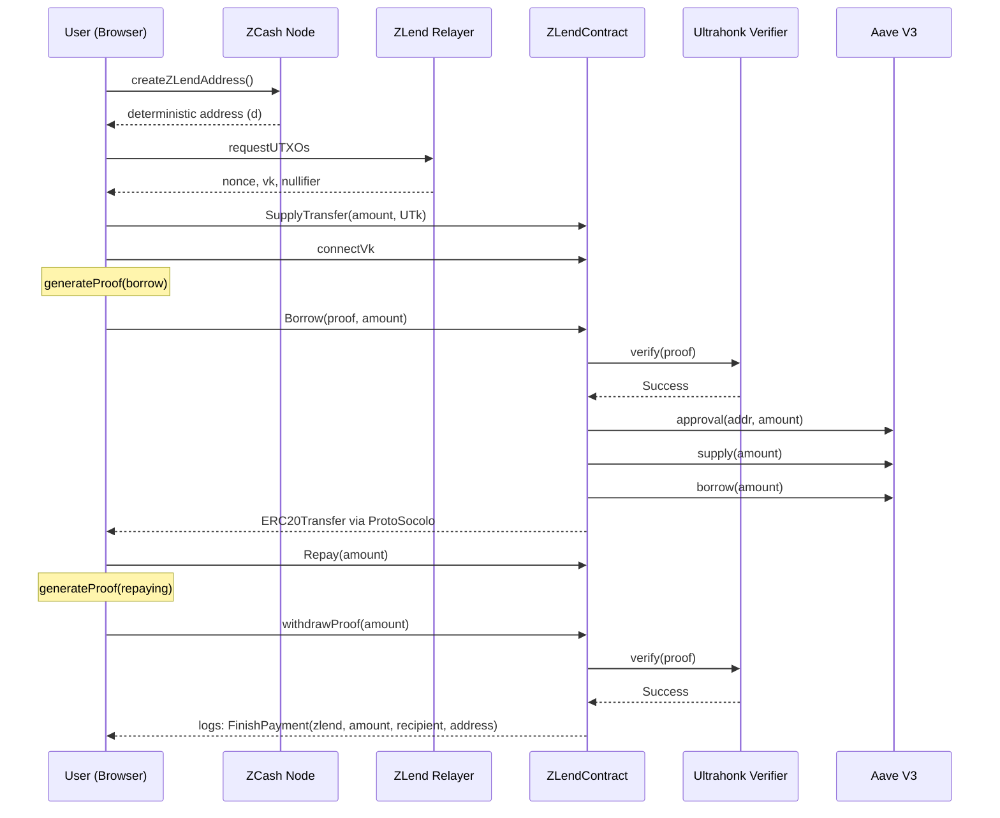

# ZLend System Architecture

ZLend is a privacy-preserving lending protocol on **Avalanche** that uses **ZCash** shielded UTXOs as collateral to borrow ERC-20 tokens via **Aave V3**. Zero-knowledge proofs (Ultrahonk) verify collateral ownership without revealing the user's ZCash address or balance on-chain.


---

## High-Level Overview

```
┌──────────────┐     ┌──────────────┐     ┌─────────────────────────────────────┐
│   Browser    │────▶│  ZCash Node  │────▶│        Avalanche (C-Chain)          │
│              │     │              │     │                                     │
│ - Adapter    │     │ createZLend  │     │ ┌─────────────┐  ┌──────────────┐  │
│ - Balance    │     │  Address()   │     │ │ ZLendContract│  │ Ultrahonk    │  │
│ - Relayer    │     │              │     │ │              │──│ Verifier     │  │
│ - Privacy    │     │  ──▶ d       │     │ │              │  └──────────────┘  │
│   Pools      │     │              │     │ │              │                    │
│              │     │  Spending Key│     │ │              │  ┌──────────────┐  │
│              │     │  & ZLend     │     │ │              │──│ Aave V3      │  │
│              │     │  Relayer     │     │ │              │  │ (Pool)       │  │
│              │     │              │     │ └─────────────┘  └──────────────┘  │
│              │     │ ZLend =      │     │                                     │
│              │     │ H(X, ZIP32)  │     │ ┌─────────────┐                    │
│              │     │  ──▶ vk, sk  │     │ │ ProtoSocolo  │                    │
│              │     │              │     │ │ (ERC-20)     │                    │
│              │     │              │     │ └─────────────┘                    │
└──────────────┘     └──────────────┘     └─────────────────────────────────────┘
```

---

## Components

### Browser Client

The user-facing application that coordinates the full lending cycle:

| Module | Responsibility |
|--------|---------------|
| **Adapter** | Wallet connection and transaction signing for both ZCash and Avalanche |
| **Balance** | Tracks ZCash UTXO balances and Avalanche ERC-20 positions |
| **Relayer** | Submits privacy-preserving transactions to Avalanche on behalf of the user |
| **Privacy Pools** | Manages shielded pool interactions and proof generation |

### ZCash Node

Provides the collateral layer:

- **`createZLendAddress()`** — Generates a deterministic ZLend address `d` using ZCash's ZIP-32 hierarchical deterministic key derivation
- **UTXO Management** — Supplies unspent transaction outputs as collateral proof inputs
- **Key Derivation** — Produces the viewing key (`vk`) and spending key (`sk`) pair used throughout the protocol

### Spending Key & ZLend Relayer

The core cryptographic bridge between ZCash and Avalanche:

```
ZLend = H(X, ZIP32) → vk, sk
```

Where:
- `H` is a hash function binding the user's identity `X` to the ZIP-32 derivation path
- `vk` (viewing key) — allows the protocol to verify collateral without spending it
- `sk` (spending key) — retained by the user, never leaves the client

The relayer holds derived keys to submit transactions on Avalanche without revealing the user's ZCash origin address.

### Avalanche Contracts

| Contract | Role |
|----------|------|
| **ZLendContract** | Core orchestrator — handles supply, borrow, repay, and withdraw flows |
| **ProtoSocolo (ERC-20)** | Token contract for internal ERC-20 transfers within the protocol |
| **Ultrahonk Verifier** | On-chain ZK proof verifier (Noir/Barretenberg) that validates collateral proofs |
| **Aave V3 (Pool)** | External lending pool — receives collateral supply and issues borrows |

---

## Data Flow



---

## Network Topology

| Layer | Network | Purpose |
|-------|---------|---------|
| Collateral | ZCash (mainnet) | Shielded UTXOs as collateral source |
| Execution | Avalanche C-Chain | Smart contracts, Aave V3 integration |
| Proving | Off-chain (client) | Noir circuits compiled to Ultrahonk proofs |
| Relaying | ZLend Relayer | Privacy-preserving transaction submission |

---

## Inspiration

The pool supply/borrow pattern is modeled after [SparkLend Core Contracts — Pool#supply](https://docs.spark.fi/dev/sparklend/core-contracts/pool#supply), adapted to work with ZK-verified cross-chain collateral from ZCash.
