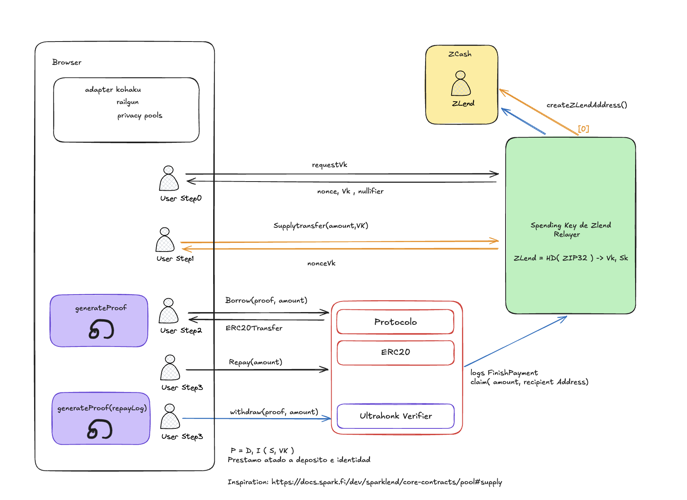
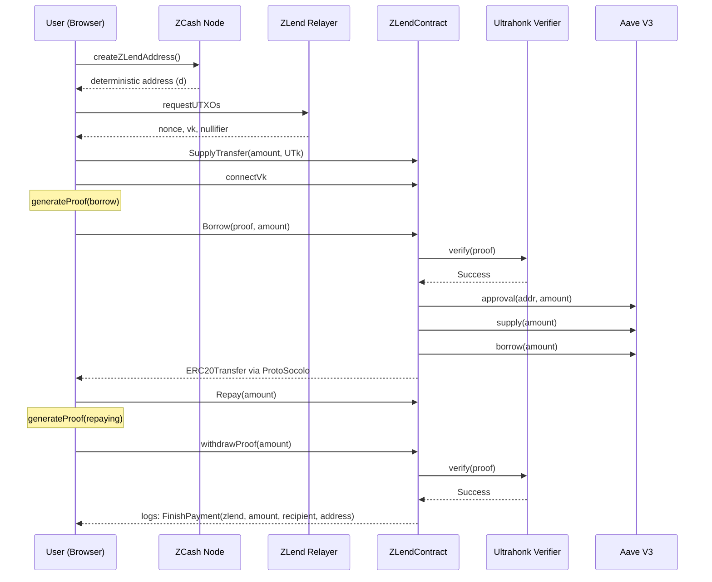

# ZLend System Architecture

ZLend is a privacy-preserving lending protocol on **Avalanche** that uses **ZCash** shielded UTXOs as collateral to borrow ERC-20 tokens via **Aave V3**. Zero-knowledge proofs (Ultrahonk) verify collateral ownership without revealing the user's ZCash address or balance on-chain.



---

## High-Level Overview

```
┌──────────────┐     ┌──────────────┐     ┌─────────────────────────────────────┐
│   Browser    │────▶│  ZCash Node  │────▶│        Avalanche (C-Chain)          │
│              │     │              │     │                                     │
│ - Adapter    │     │ createZLend  │     │ ┌─────────────┐  ┌──────────────┐  │
│ - Balance    │     │  Address()   │     │ │ ZLendContract│  │ Ultrahonk    │  │
│ - Relayer    │     │              │     │ │              │──│ Verifier     │  │
│ - Privacy    │     │  ──▶ d       │     │ │              │  └──────────────┘  │
│   Pools      │     │              │     │ │              │                    │
│              │     │  Spending Key│     │ │              │  ┌──────────────┐  │
│              │     │  & ZLend     │     │ │              │──│ Aave V3      │  │
│              │     │  Relayer     │     │ │              │  │ (Pool)       │  │
│              │     │              │     │ └─────────────┘  └──────────────┘  │
│              │     │ ZLend =      │     │                                     │
│              │     │ H(X, ZIP32)  │     │ ┌─────────────┐                    │
│              │     │  ──▶ vk, sk  │     │ │ ProtoSocolo  │                    │
│              │     │              │     │ │ (ERC-20)     │                    │
│              │     │              │     │ └─────────────┘                    │
└──────────────┘     └──────────────┘     └─────────────────────────────────────┘
```

---

## Components

### Browser Client

The user-facing application that coordinates the full lending cycle:

| Module | Responsibility |
|--------|---------------|
| **Adapter** | Wallet connection and transaction signing for both ZCash and Avalanche |
| **Balance** | Tracks ZCash UTXO balances and Avalanche ERC-20 positions |
| **Relayer** | Submits privacy-preserving transactions to Avalanche on behalf of the user |
| **Privacy Pools** | Manages shielded pool interactions and proof generation |

### ZCash Node (External or Local)

The ZCash node provides the collateral layer. It can be an **external service** (Tatum API, lightwalletd) or a local full node — sensitive operations always run client-side.

| Operation | Can Be External? | Provider |
|-----------|:-:|----------|
| `createZLendAddress()` | Client-side | `WebZjs` (ChainSafe/WebZjs) WASM in browser |
| Block data (`getblock`, `getblockchaininfo`, etc.) | Yes | Tatum API / lightwalletd |
| Transaction broadcast (`sendrawtransaction`) | Yes | Tatum API / lightwalletd |
| UTXO queries (`gettxout`, `gettxoutproof`) | Yes | Tatum API |
| Fee estimation (`estimatesmartfee`) | Yes | Tatum API |
| Shielded note scanning (`z_*` RPCs) | **No** | Client-side trial decryption |

**Client-Side Trial Decryption**: Instead of sending the viewing key to a node, the browser fetches compact blocks from the external node and performs trial decryption locally using `WebZjs` (WASM-compiled Rust `orchard` crate) and the user's `ivk`. Only notes decryptable by the user's `ivk` are recognized. The `ivk` never leaves the browser.

### Spending Key, FROST & ZLend Relayer

The core cryptographic bridge between ZCash and Avalanche:

```
ZLend = H(X, ZIP32) → vk, sk
```

Where:
- `H` is a hash function binding the user's identity `X` to the ZIP-32 derivation path
- `vk` (viewing key) — allows the protocol to verify collateral without spending it
- `sk` (spending key) — retained by the user, never leaves the client

From `sk`, the **spend authorizing key** (`ask`) is derived. This is the key that produces RedPallas signatures authorizing Zcash spends:

```
sk (spending key)
  → ask (spend authorizing key) ← split via FROST
  → nk  (nullifier key)
  → rivk (raw incoming viewing key)
```

#### FROST Threshold Signing (2-of-3)

Rather than holding `ask` as a single secret, ZLend splits it using **FROST** (Flexible Round-Optimized Schnorr Threshold signatures) with the `frost-rerandomized` RedPallas ciphersuite from `ZcashFoundation/frost`. The full `ask` is **never reconstructed** — partial signatures are combined into a valid RedPallas signature indistinguishable from a standard Orchard spend authorization.

| Share Holder | Shares | Role |
|-------------|--------|------|
| User (browser) | Share 1 + Share 2 | Primary signer — can sign alone (2-of-3 met) |
| Relayer | Share 3 | Co-signer — cannot sign alone, but user + relayer = valid |
| Backup (cold storage) | Share 2 (copy) | Recovery — user share 1 + backup = valid |

#### Relayer Role (Co-Signer Model)

The relayer evolves from a "submitter-only" to a **threshold co-signer**:

- Holds `vk` (viewing key) + 1 FROST share of `ask`
- Cannot spend alone (1-of-3 is insufficient)
- Can enforce policy before co-signing (compliance checks, rate limiting)
- User retains full sovereignty (holds 2-of-3, can always sign independently)
- If relayer goes down or censors, user signs alone and self-submits

### Avalanche Contracts

| Contract | Role |
|----------|------|
| **ZLendContract** | Core orchestrator — handles supply, borrow, repay, and withdraw flows |
| **ProtoSocolo (ERC-20)** | Token contract for internal ERC-20 transfers within the protocol |
| **Ultrahonk Verifier** | On-chain ZK proof verifier (Noir/Barretenberg) that validates collateral proofs |
| **Aave V3 (Pool)** | External lending pool — receives collateral supply and issues borrows |

---

## Data Flow



---

## Network Topology

| Layer | Network | Purpose |
|-------|---------|---------|
| Collateral | ZCash (mainnet) | Shielded UTXOs as collateral source |
| Chain Access | Tatum API / lightwalletd | External node for public chain queries and tx broadcast |
| Scanning | Off-chain (client) | Trial decryption of compact blocks with `ivk` in browser |
| Execution | Avalanche C-Chain | Smart contracts, Aave V3 integration |
| Proving | Off-chain (client) | Noir circuits compiled to Ultrahonk proofs |
| Relaying | ZLend Relayer (co-signer) | FROST co-signing + privacy-preserving transaction submission |

---

## Phased Privacy Roadmap

Privacy features are delivered incrementally across three phases:

### Phase 1 — MVP

| Feature | Implementation |
|---------|---------------|
| Collateral privacy | ZK proofs (Ultrahonk/Noir) verify UTXO ownership without revealing ZCash address |
| Replay protection | Nullifier-per-borrow-cycle + state root binding ([Protocol Spec](02_protocol.md#nullifier-per-borrow-cycle)) |
| Token transfers | Standard ERC-20 (ProtoSocolo) — borrow amounts are public |
| Event matching | Hash-based filtering: `H(vk, event_data)` — client-side matching |
| Key derivation | ZIP-32 Sapling: `m_Sapling / 32' / 133' / account' / zlend_index` ([Details](05_zcash-integration.md#zip-32-derivation-details)) |

### Phase 2 — Enhanced Privacy

| Feature | Implementation |
|---------|---------------|
| Private balances | ZAMA fhEVM encrypted ERC-20 (once Avalanche support ships, expected H1 2026) |
| Private event matching | ZK regex via [noir-zk-regex](https://github.com/hashcloak/noir-zk-regex) (once Noir target matures) |
| Privacy Pools | Adapt [Kohaku](https://github.com/ethereum/kohaku) `@kohaku-eth/privacy-pools` for deposit set membership and exclusion proofs |

### Phase 3 — Advanced Features

| Feature | Implementation |
|---------|---------------|
| Threshold signatures | BLS threshold schemes via Shamir's Secret Sharing for multi-sig collateral |
| Railgun integration | Shielded ERC-20 transfers following Kohaku `@kohaku-eth/railgun` patterns |
| ZK compliance | Zero-knowledge AML/FT attestations — prove compliance without revealing identity |

---

## Inspiration

The pool supply/borrow pattern is modeled after [SparkLend Core Contracts — Pool#supply](https://docs.spark.fi/dev/sparklend/core-contracts/pool#supply), adapted to work with ZK-verified cross-chain collateral from ZCash.
