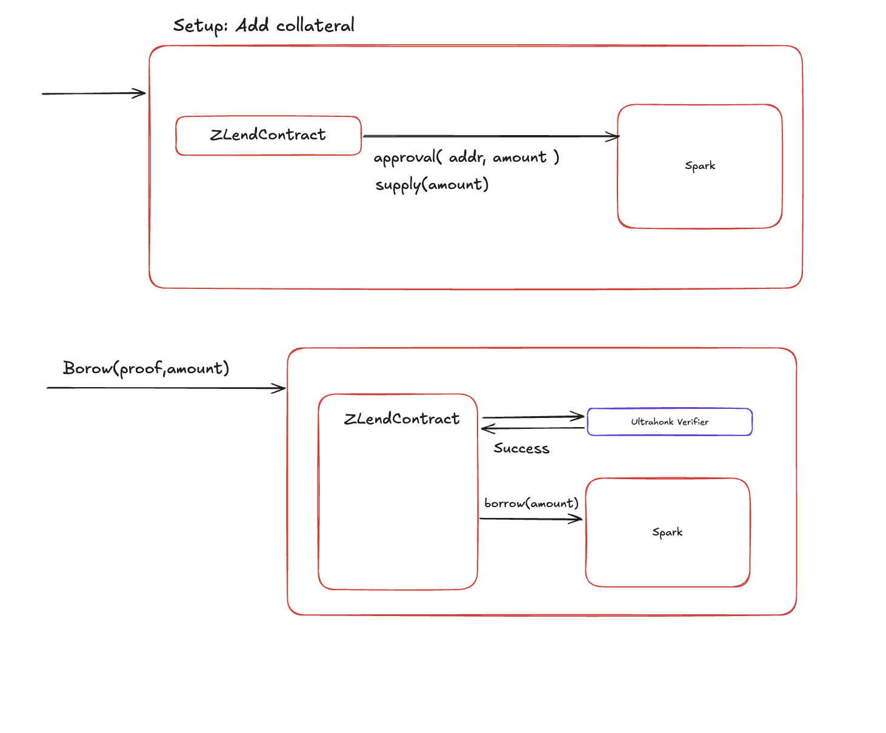

# Smart Contract Architecture

## Overview

OGBank's on-chain layer consists of three core contracts on **Avalanche C-Chain** and an integration with the existing **Aave V3** deployment.



---

## Contract Diagram

```
┌─────────────────────────────────────────────────────────────────┐
│                      Avalanche C-Chain                          │
│                                                                 │
│  ┌──────────────────┐         ┌────────────────────┐           │
│  │  OGBankContract    │────────▶│  Ultrahonk Verifier │           │
│  │                   │◀────────│  (Noir/Barretenberg)│           │
│  │  - supply()       │ Success │                    │           │
│  │  - borrow()       │         └────────────────────┘           │
│  │  - repay()        │                                          │
│  │  - withdraw()     │         ┌────────────────────┐           │
│  │                   │────────▶│  Aave V3 Pool       │           │
│  │                   │         │                    │           │
│  │                   │         │  - approval()      │           │
│  │                   │         │  - supply()        │           │
│  │                   │         │  - borrow()        │           │
│  │                   │         │  - repay()         │           │
│  └────────┬─────────┘         └────────────────────┘           │
│           │                                                     │
│           │ ERC20Transfer                                       │
│           ▼                                                     │
│  ┌──────────────────┐                                           │
│  │  ProtoSocolo      │                                           │
│  │  (ERC-20)         │                                           │
│  └──────────────────┘                                           │
└─────────────────────────────────────────────────────────────────┘
```

---

## OGBankContract

The core orchestrator contract. All user interactions flow through this contract.

### Setup: Add Collateral

```
User → OGBankContract → Aave V3
```

1. OGBankContract calls `approval(addr, amount)` on the Aave V3 pool — authorizes the pool to pull tokens
2. OGBankContract calls `supply(amount)` on the Aave V3 pool — deposits collateral

### Borrow Flow

```
User → OGBankContract → Ultrahonk Verifier → Aave V3
```

1. User submits `Borrow(proof, amount)` to OGBankContract
2. OGBankContract forwards the proof to the **Ultrahonk Verifier**
3. Verifier returns `Success` if the ZK proof is valid
4. OGBankContract calls `borrow(amount)` on the Aave V3 pool
5. Borrowed ERC-20 tokens are transferred to the user via ProtoSocolo

### Repay Flow

```
User → OGBankContract → Aave V3
```

1. User calls `Repay(amount)` with ERC-20 tokens
2. OGBankContract forwards the repayment to Aave V3

### Withdraw Flow

```
User → OGBankContract → Ultrahonk Verifier → User
```

1. User submits `withdrawProof(amount)` with a ZK proof of repayment
2. OGBankContract verifies the proof via the Ultrahonk Verifier
3. On success, emits `FinishPayment(ogbank, amount, recipient, address)`
4. Collateral is released back to the user's ZCash shielded address

### Interface (Expected)

```solidity
interface IOGBankContract {
    /// @notice Supply collateral from verified ZCash UTXOs
    /// @param amount Amount of collateral to supply
    /// @param utk UTXO token reference
    function supplyTransfer(uint256 amount, bytes calldata utk) external;

    /// @notice Connect a viewing key to the protocol
    /// @param vk The ZCash viewing key
    function connectVk(bytes calldata vk) external;

    /// @notice Borrow against verified collateral
    /// @dev Creates a unique borrow nullifier to prevent replay attacks on withdraw
    /// @param proof Ultrahonk ZK proof of collateral ownership
    /// @param amount Amount to borrow
    function borrow(bytes calldata proof, uint256 amount) external;

    /// @notice Repay borrowed tokens
    /// @param amount Amount to repay
    function repay(uint256 amount) external;

    /// @notice Withdraw collateral with proof of repayment
    /// @dev Consumes the borrow nullifier — prevents replay of the same withdraw proof
    /// @param proof Ultrahonk ZK proof of completed repayment (must reference a valid borrow nullifier)
    /// @param amount Amount to withdraw
    function withdrawProof(bytes calldata proof, uint256 amount) external;

    /// @notice Emitted on successful withdrawal
    event FinishPayment(
        address indexed ogbank,
        uint256 amount,
        address recipient,
        address originAddress
    );
}
```

### Nullifier Storage

The contract maintains two nullifier mappings for replay protection (see [Protocol Spec](02_protocol.md#nullifier-per-borrow-cycle)):

```solidity
/// @notice Tracks active borrow cycle nullifiers
mapping(bytes32 => bool) public borrowNullifiers;

/// @notice Tracks consumed nullifiers (already withdrawn)
mapping(bytes32 => bool) public consumedNullifiers;
```

---

## ProtoSocolo (ERC-20)

An ERC-20 token contract used for internal transfers within the OGBank protocol. Handles the movement of borrowed tokens from the Aave V3 pool to the end user.

- Standard ERC-20 interface
- Used as the intermediary for `ERC20Transfer` operations after a successful borrow

---

## Ultrahonk Verifier

An on-chain zero-knowledge proof verifier based on the **Ultrahonk** proving system from Aztec's **Barretenberg** library.

### What It Verifies

| Operation | Proof Statement |
|-----------|----------------|
| **Borrow** | "I own ZCash UTXOs worth ≥ `amount` at address derived from my viewing key, and these UTXOs have not been previously collateralized (nullifier check)" |
| **Withdraw** | "My borrow position (identified by `borrow_nullifier`) has been fully repaid and the collateral at my OGBank address can be released" |

### Implementation

- Circuits written in **Noir** (Aztec's ZK DSL)
- Compiled to **Ultrahonk** proof format
- On-chain verifier contract generated by Barretenberg
- Single `verify(bytes calldata proof) returns (bool)` interface

---

## Aave V3 Integration

OGBank integrates with the **existing Aave V3 deployment on Avalanche** — no fork required.

### Interactions

| Function | Direction | Description |
|----------|-----------|-------------|
| `approval(addr, amount)` | OGBank → Aave V3 | Approve the pool to pull collateral tokens |
| `supply(amount)` | OGBank → Aave V3 | Deposit collateral into the lending pool |
| `borrow(amount)` | OGBank → Aave V3 | Borrow against supplied collateral |
| `repay(amount)` | OGBank → Aave V3 | Repay borrowed tokens |

### Relevant Aave V3 Addresses (Avalanche C-Chain)

These should be verified against Aave's official documentation before deployment:
- Pool proxy
- PoolAddressesProvider
- Relevant aToken and debtToken addresses
