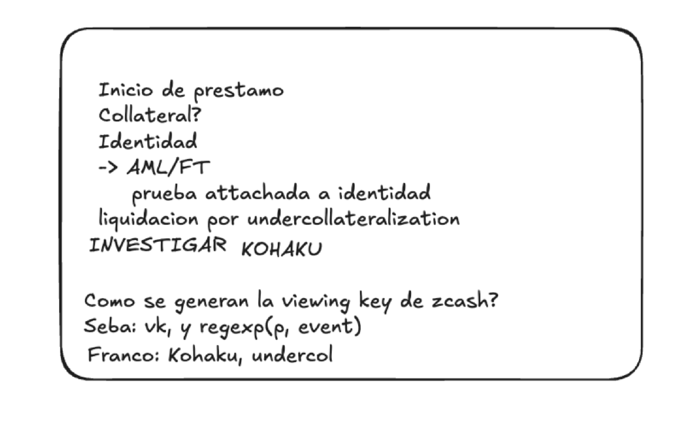

# Privacy Model & Identity

## Overview

OGBank's privacy model bridges ZCash's shielded transaction system with Avalanche's public EVM. The protocol ensures that **collateral ownership is verified without revealing the collateral source** — a user can borrow on Avalanche without anyone on-chain being able to link the borrow to their ZCash address.



---

## Privacy Guarantees

### What Is Hidden

| Data | Hidden From | Mechanism |
|------|-------------|-----------|
| ZCash source address | Avalanche observers | ZK proof verifies ownership without revealing address |
| UTXO amounts | On-chain contracts | Proof asserts "balance ≥ threshold" without disclosing exact value |
| Spending key (`sk`) | Everyone except user | Never leaves the browser client |
| Link between ZCash identity and Avalanche address | Public | Relayer submits transactions on behalf of user |

### What Is Revealed

| Data | Visible To | Reason |
|------|-----------|--------|
| Borrow amount | Avalanche chain | Required for Aave V3 interaction |
| Repay amount | Avalanche chain | Required for Aave V3 interaction |
| Viewing key (`vk`) | OGBankContract, Relayer | Required for collateral verification |
| Proof validity | Ultrahonk Verifier | Binary yes/no — no collateral details leak |

---

## Relayer Privacy Model

The OGBank Relayer is the critical privacy component. It acts as an intermediary that breaks the on-chain link between the user's ZCash identity and their Avalanche borrow.

### How It Works

1. **User generates proof locally** — The ZK proof is created client-side using the spending key
2. **Relayer receives the proof** — Not the spending key, not the source address
3. **Relayer submits to Avalanche** — The transaction appears to come from the relayer, not the user
4. **Borrowed tokens routed to user** — Via ProtoSocolo ERC-20 to a user-specified Avalanche address

### Relayer Trust Assumptions

| Property | Status |
|----------|--------|
| Can the relayer steal collateral? | No — requires spending key (`sk`) |
| Can the relayer censor transactions? | Yes — but user can switch relayers or submit directly |
| Can the relayer link ZCash ↔ Avalanche? | Partially — the relayer sees the viewing key and submission timing |
| Can the relayer front-run? | Depends on implementation — needs MEV protection |

---

## Identity & Compliance

### AML/FT Considerations

The protocol must balance privacy with regulatory compliance:

- **ZK Identity Proofs** — A proof can be attached to a user's identity without revealing the identity itself. The proof asserts: "I am a compliant entity per AML/FT requirements" without disclosing who the entity is.
- **Selective disclosure** — Users can optionally reveal their identity to specific parties (regulators, auditors) using the viewing key without exposing it on-chain.
- **Compliance oracle** — A potential integration point where an off-chain compliance check produces a ZK attestation that the user's collateral source is clean.

### Identity-Collateral Binding

```
Identity Proof ──▶ ZK Circuit ──▶ Attestation (on-chain)
                                      │
                                      ▼
                              OGBankContract accepts
                              borrow with attestation
```

The identity proof is **attached to the user's OGBank Unit**, not to their public Avalanche address. Each user has exactly **one OGBank Unit** (1:1 — one seed produces one key pair via ZIP-32). This means:

- Each user has a single collateral position with a single compliance attestation
- Liquidators and protocol participants don't see the identity
- Regulators with the viewing key can verify compliance retroactively

---

## Liquidation Under Privacy

### The Challenge

When a user's ZCash collateral drops below the required collateralization ratio, the protocol must liquidate — but the collateral details are private.

### Undercollateralization Detection

| Approach | Description |
|----------|-------------|
| **Oracle-based** | A price oracle reports ZEC/USD; the protocol checks the borrow-to-collateral ratio using the committed (hidden) collateral amount |
| **Proof-based** | The user must periodically submit a "solvency proof" — a ZK proof that their collateral still meets the threshold |
| **Timeout-based** | If the user fails to submit a solvency proof within a window, the position is flagged for liquidation |

### Liquidation Process

1. Price oracle triggers undercollateralization signal
2. OGBankContract marks the position as liquidatable
3. Liquidator submits a liquidation transaction
4. The protocol reveals the minimum collateral information needed for liquidation (via viewing key)
5. Collateral is seized and sold on Aave V3

---

## Privacy Pools

The browser client includes a **Privacy Pools** module that manages:

- **Deposit set membership** — Proves the user's collateral belongs to a set of "clean" deposits
- **Exclusion proofs** — Proves the collateral is NOT from a sanctioned or flagged source
- **Pool mixing** — Multiple users' collateral is pooled to increase the anonymity set

This is inspired by the [Privacy Pools](https://papers.ssrn.com/sol3/papers.cfm?abstract_id=4563364) research by Buterin, Soleimani, et al. — balancing privacy with compliance.

---

## Threat Model

| Threat | Mitigation |
|--------|------------|
| Relayer collusion | User can verify all proofs client-side; relayer cannot forge proofs |
| Timing analysis | Randomized submission delays in the relayer |
| Amount correlation | Privacy pools mix multiple users' positions |
| Viewing key leak | Viewing key allows observation but not spending; damage is limited to privacy loss |
| Replay attacks on withdraw | Nullifier system prevents reuse of the same proof (see [Research](06_research.md)) |
