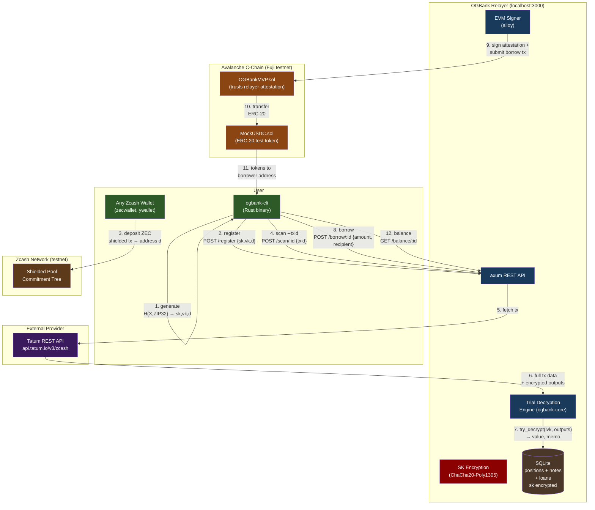
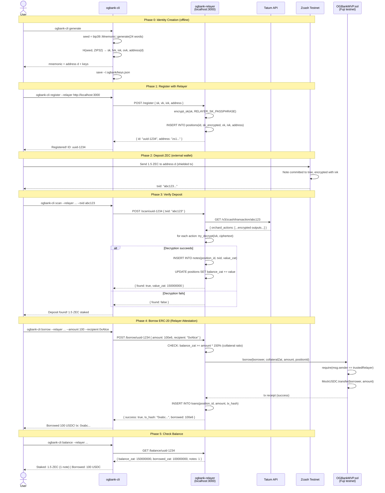
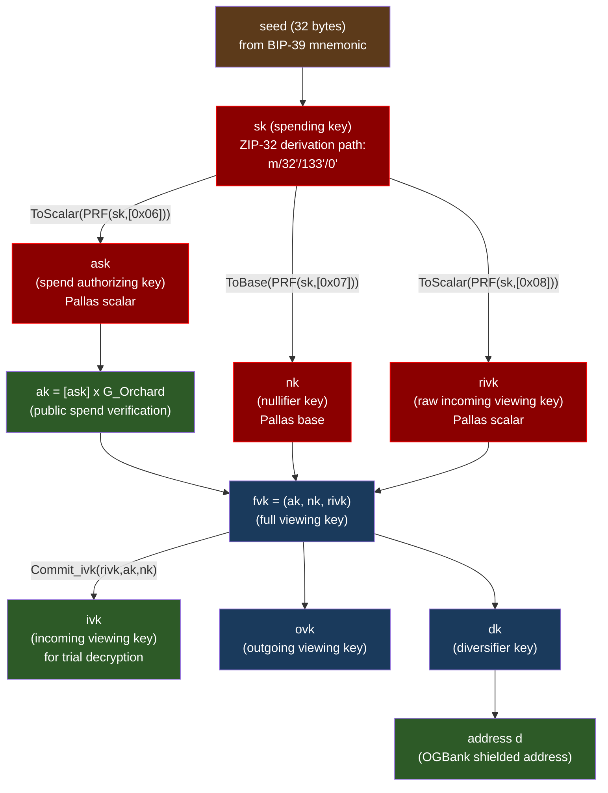
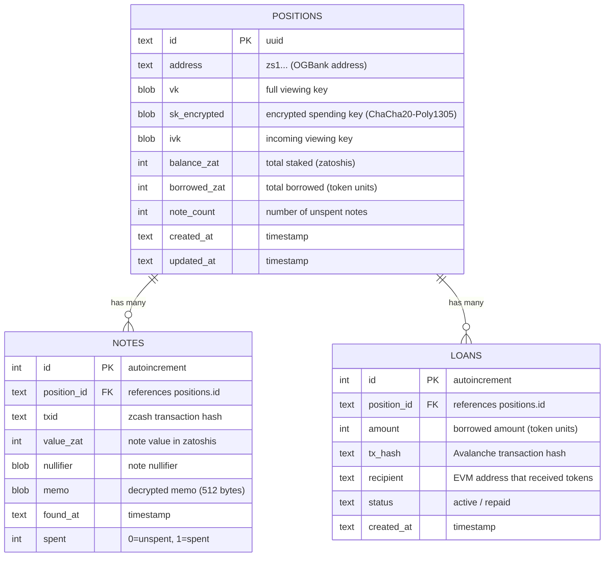
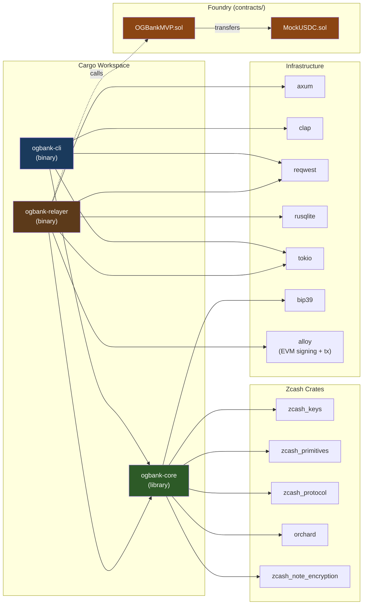

# OGBank MVP — Architecture & Diagrams

This document describes the MVP Proof-of-Concept implementation located in `MVP-POC/`.

## System Architecture



## Full Sequence: Generate → Stake → Verify → Borrow



## Key Derivation Tree



## Data Model (SQLite)



## Crate Dependency Graph



## MVP vs Production Scope

```mermaid
graph TB
    subgraph MVP ["MVP (this implementation)"]
        M1["ZIP-32 key derivation"]
        M2["sk encrypted at rest (ChaCha20-Poly1305 + Argon2)"]
        M3["Deposit verification via trial decryption"]
        M4["Balance tracking (SQLite)"]
        M5["Tatum API (Plan B)"]
        M6["CLI tool"]
        M7["Relayer attestation borrow"]
        M8["OGBankMVP.sol on Avalanche Fuji"]
        M9["MockUSDC ERC-20 transfer"]
    end

    subgraph V1 ["v1 (next)"]
        V1A["FROST 2-of-3 replaces encrypted sk"]
        V1B["Upgrade to full OGBankContract"]
        V1C["Unified 2-mode Noir circuit + Ultrahonk verifier"]
        V1D["Full chain scanning"]
        V1E["Repay + withdraw via auth mode (nullifier chain)"]
        V1F["Aave V3 integration"]
        V1G["Debt Notes — UTXO-style debt Merkle tree"]
        V1H["Partial repayments via change notes"]
        V1I["Chainlink ZEC/USD price oracle"]
    end

    subgraph V2 ["v2 (future)"]
        V2A["FHE-encrypted operations (Fhenix)"]
        V2B["Privacy Pools"]
        V2C["Liquidation mechanism"]
        V2D["Chainlink CCIP"]
        V2E["Fhenix cUSDC (encrypted balances)"]
        V2F["Halo2 recursive proofs (native Orchard verification)"]
    end

    MVP --> V1 --> V2

    style MVP fill:#2d5a27,color:#fff
    style V1 fill:#1a3a5c,color:#fff
    style V2 fill:#5c3a1a,color:#fff
```



## SK Security — Encryption at Rest

The spending key (`sk`) is encrypted before storage using **ChaCha20-Poly1305** with a key derived from a passphrase via **Argon2id**.

```
Registration:
  CLI sends sk → Relayer encrypts sk with ChaCha20-Poly1305 → stores ciphertext in SQLite

Operations needing sk:
  Relayer reads ciphertext from SQLite → decrypts with in-memory key → uses sk → zeroes memory

Encryption key derivation:
  RELAYER_SK_PASSPHRASE (env var) → Argon2id(passphrase, salt) → 256-bit symmetric key
  Key lives only in memory. Never written to disk.

Storage format:
  salt(16 bytes) || nonce(12 bytes) || ciphertext
```

### Threat Model

| Threat | Protected? |
|--------|:----------:|
| SQLite file stolen/leaked | Yes — sk is ciphertext |
| Database backup exfiltrated | Yes — useless without passphrase |
| Relayer process memory dump | No (sk decrypted in memory during use) |
| Relayer operator (has passphrase) | No (custodial trust model for MVP) |

### Upgrade Path to FROST

1. Replace `encrypt_sk` / `decrypt_sk` with FROST key splitting
2. Relayer stores only 1 FROST share (not encrypted full sk)
3. User holds 2 shares (2-of-3 threshold met without relayer)
4. Uses `frost-rerandomized` crate from `ZcashFoundation/frost`
5. Full `ask` is **never reconstructed** — partial signatures combine into valid RedPallas

## Directory Structure

```
MVP-POC/
├── Cargo.toml              (workspace root)
├── .gitignore
├── crates/
│   ├── ogbank-core/         (shared Zcash crypto)
│   │   ├── Cargo.toml
│   │   └── src/
│   │       ├── lib.rs
│   │       ├── keys.rs     (ZIP-32 derivation)
│   │       ├── scan.rs     (trial decryption)
│   │       └── crypto.rs   (ChaCha20-Poly1305 encryption)
│   │
│   ├── ogbank-cli/          (CLI binary)
│   │   ├── Cargo.toml
│   │   └── src/
│   │       └── main.rs     (generate, register, balance, scan, borrow)
│   │
│   └── ogbank-relayer/      (relayer binary)
│       ├── Cargo.toml
│       └── src/
│           ├── main.rs     (axum server startup)
│           ├── api.rs      (REST endpoints)
│           ├── db.rs       (SQLite schema + queries)
│           ├── zcash.rs    (Tatum API client)
│           └── evm.rs      (alloy EVM signer + contract calls)
│
└── contracts/              (Foundry project)
    ├── foundry.toml
    ├── src/
    │   ├── OGBankMVP.sol    (core contract — relayer attestation borrow)
    │   └── MockUSDC.sol    (test ERC-20 token)
    ├── script/
    │   └── Deploy.s.sol    (deployment script for Fuji testnet)
    └── test/
        └── OGBankMVP.t.sol  (contract tests)
```

## Quick Start

```bash
# Build Rust workspace
cd MVP-POC && cargo build

# Run tests
cargo test

# Run Solidity tests
cd contracts && forge test

# Generate identity
cargo run -p ogbank-cli -- generate

# Start relayer
RELAYER_SK_PASSPHRASE=my-secret cargo run -p ogbank-relayer

# Register with relayer
cargo run -p ogbank-cli -- register --relayer http://localhost:3000

# Check balance
cargo run -p ogbank-cli -- balance --relayer http://localhost:3000
```
