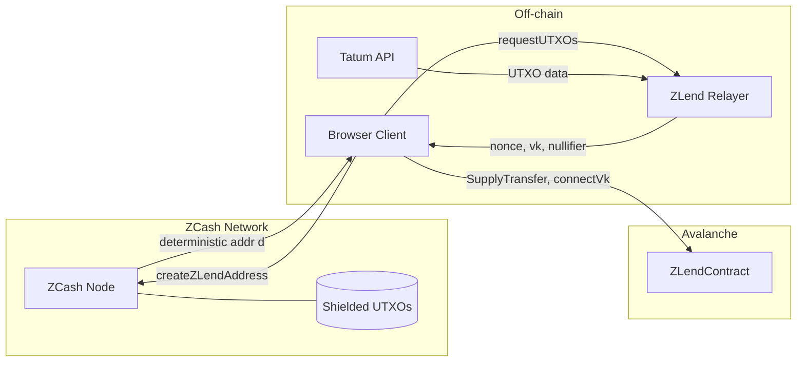

# ZCash Integration

## Overview

ZLend uses ZCash's shielded transaction model as the collateral layer. The protocol interfaces with ZCash via JSON-RPC to validate addresses, fetch UTXOs, and verify transaction proofs. Key derivation follows the ZIP-32 standard for hierarchical deterministic wallets (Sapling/Orchard).


---

## ZCash JSON-RPC Interface

The following RPC methods are used or available for ZLend's ZCash integration:

### Address & Validation

| Method | Purpose |
|--------|---------|
| `validateaddress` | Validate a ZCash address format and type (transparent/shielded) |

### Block Data

| Method | Purpose |
|--------|---------|
| `getblockchaininfo` | Current chain state, height, difficulty |
| `getblock` | Full block data by hash |
| `getblockcount` | Current block height |
| `getblockstats` | Per-block statistics |
| `getblockheader` | Block header by hash |
| `getblockhash` | Block hash by height |
| `getbestblockhash` | Hash of the current tip |
| `getdifficulty` | Current mining difficulty |
| `getchaintips` | All known chain tips |

### Transaction Management

| Method | Purpose |
|--------|---------|
| `sendrawtransaction` | Broadcast a signed transaction |
| `createrawtransaction` | Build an unsigned transaction |
| `getrawtransaction` | Fetch raw transaction data by txid |
| `gettxout` | Get specific UTXO by txid and vout index |
| `decoderawtransaction` | Decode a raw transaction hex |
| `decodescript` | Decode a script hex |

### Mempool

| Method | Purpose |
|--------|---------|
| `getmempoolinfo` | Mempool size and state |
| `getrawmempool` | All transaction IDs in mempool |
| `getmempoolancestors` | Ancestor transactions of a mempool entry |
| `getmempooldescendants` | Descendant transactions of a mempool entry |
| `getmempoolentry` | Detailed mempool data for a specific txid |

### Proof & Verification

| Method | Purpose |
|--------|---------|
| `verifymessage` | Verify a signed message |
| `verifytxoutproof` | Verify a UTXO inclusion proof |
| `gettxoutproof` | Generate a UTXO inclusion proof (Merkle proof) |

### Fee Estimation

| Method | Purpose |
|--------|---------|
| `estimatesmartfee` | Estimate fee rate for confirmation target |

---

## Key Libraries & Tools

### ZCash Primitives (JavaScript)

**Repository**: [zcash-hackworks/zcash-primitives-js](https://github.com/zcash-hackworks/zcash-primitives-js/tree/master/src)

JavaScript implementation of ZCash cryptographic primitives. Used for:
- Key derivation (ZIP-32 Sapling/Orchard paths)
- Address generation (`createZLendAddress()`)
- Note encryption/decryption
- Viewing key operations

### ZCash RPC Documentation

**Reference**: [zcash-rpc.github.io](https://zcash-rpc.github.io/)

Official ZCash RPC method documentation and parameter specifications.

### UTXO Fetching (Tatum)

- **UTXO API**: [Postman — blockchainnow/tatum-io — get-utxos-200](https://www.postman.com/blockchainnow/tatum-io/request/kqirish/get-utxos-200)
- **Address Validation**: [docs.tatum.io — rpc-zcash-validateaddress](https://docs.tatum.io/reference/rpc-zcash-validateaddress)

Tatum provides REST APIs for fetching ZCash UTXOs and validating addresses without running a full node.

---

## ZK Tooling

### Noir ZK Regex

**Repository**: [hashcloak/noir-zk-regex](https://github.com/hashcloak/noir-zk-regex)

Noir library for zero-knowledge regular expression matching. Used for:
- Matching viewing key patterns against on-chain event data
- Pattern: `regexp(p, event)` — proves a viewing key matches an event without revealing the key

### zk-regex-v2

**Reference**: [zk.email/blog/zk-regex-v2](https://zk.email/blog/zk-regex-v2)

Second generation ZK regex implementation from zk.email. Provides the theoretical foundation for pattern matching within ZK circuits.

---

## Viewing Key Generation

ZCash viewing keys (`vk`) are derived through the ZIP-32 key tree:

```
Master Seed
    └── ZIP-32 Derivation Path
          └── Spending Key (sk) ── kept client-side
          └── Viewing Key (vk) ── shared with protocol
                └── Incoming Viewing Key (ivk)
                └── Full Viewing Key (fvk)
                └── Outgoing Viewing Key (ovk)
```

### Usage in ZLend

- **`vk`** is shared with the ZLend Relayer and ZLendContract to verify UTXO ownership
- **`sk`** is never transmitted — stays in the user's browser client
- **Event matching**: `regexp(p, event)` — the viewing key is used to scan for relevant on-chain events without revealing which events belong to the user
- **Deterministic derivation**: `ZLend = H(X, ZIP32) → vk, sk` ensures the same user always derives the same key pair

---

## Integration Architecture


