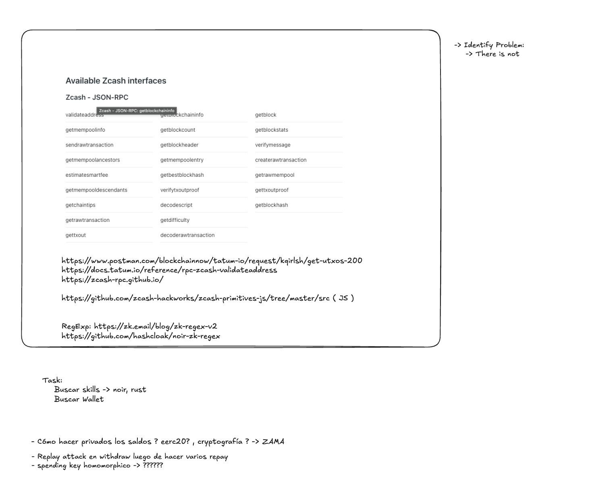
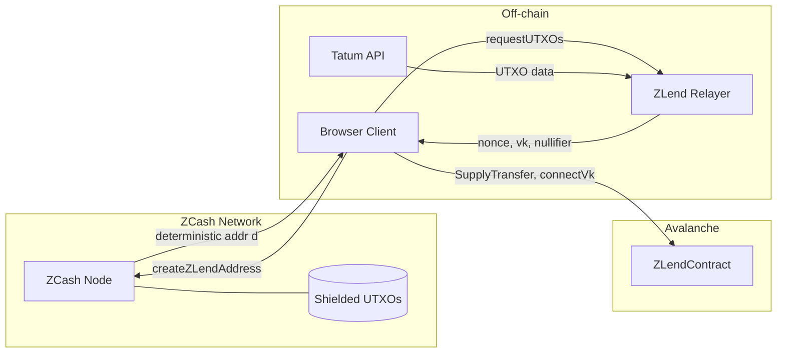

# ZCash Integration

## Overview

ZLend uses ZCash's shielded transaction model as the collateral layer. The protocol interfaces with ZCash via JSON-RPC to validate addresses, fetch UTXOs, and verify transaction proofs. Key derivation follows the ZIP-32 standard for hierarchical deterministic wallets (Sapling/Orchard).



---

## ZCash JSON-RPC Interface

The following RPC methods are used or available for ZLend's ZCash integration:

### Address & Validation

| Method | Purpose |
|--------|---------|
| `validateaddress` | Validate a ZCash address format and type (transparent/shielded) |

### Block Data

| Method | Purpose |
|--------|---------|
| `getblockchaininfo` | Current chain state, height, difficulty |
| `getblock` | Full block data by hash |
| `getblockcount` | Current block height |
| `getblockstats` | Per-block statistics |
| `getblockheader` | Block header by hash |
| `getblockhash` | Block hash by height |
| `getbestblockhash` | Hash of the current tip |
| `getdifficulty` | Current mining difficulty |
| `getchaintips` | All known chain tips |

### Transaction Management

| Method | Purpose |
|--------|---------|
| `sendrawtransaction` | Broadcast a signed transaction |
| `createrawtransaction` | Build an unsigned transaction |
| `getrawtransaction` | Fetch raw transaction data by txid |
| `gettxout` | Get specific UTXO by txid and vout index |
| `decoderawtransaction` | Decode a raw transaction hex |
| `decodescript` | Decode a script hex |

### Mempool

| Method | Purpose |
|--------|---------|
| `getmempoolinfo` | Mempool size and state |
| `getrawmempool` | All transaction IDs in mempool |
| `getmempoolancestors` | Ancestor transactions of a mempool entry |
| `getmempooldescendants` | Descendant transactions of a mempool entry |
| `getmempoolentry` | Detailed mempool data for a specific txid |

### Proof & Verification

| Method | Purpose |
|--------|---------|
| `verifymessage` | Verify a signed message |
| `verifytxoutproof` | Verify a UTXO inclusion proof |
| `gettxoutproof` | Generate a UTXO inclusion proof (Merkle proof) |

### Fee Estimation

| Method | Purpose |
|--------|---------|
| `estimatesmartfee` | Estimate fee rate for confirmation target |

---

## External Node Strategy

ZLend does **not** require running a local Zcash full node. The RPC methods listed above are split into two categories based on trust requirements:

### Safe to Externalize (Tatum API / lightwalletd)

All methods in the tables above — block data, transaction management, mempool, proof & verification, fee estimation — operate on **public chain data**. These can be safely served by external providers:

- **Tatum API**: `https://zcash-mainnet.gateway.tatum.io` (JSON-RPC over HTTPS, requires `x-api-key` header)
- **Zebra lightwalletd**: gRPC interface on port 9067, serves compact blocks for wallet scanning

No privacy is lost because this data is already public on the Zcash blockchain.

**IP Privacy Warning**: When using `sendrawtransaction` via Tatum or any external node, the user's IP address is visible to the provider. While the shielded transaction payload is opaque, the IP metadata can correlate the originator. **Recommendation**: Route transaction broadcasts through Tor or a VPN to prevent IP-based deanonymization.

### Must Stay Client-Side

The `z_*` family of wallet RPCs (`z_listunspent`, `z_getbalance`, `z_sendmany`, `z_shieldcoinbase`, etc.) are **never externalized**. These require the spending or viewing key and are not available through Tatum or public lightwalletd instances.

Instead, ZLend uses **client-side trial decryption** (see below).

---

## Client-Side Trial Decryption

Instead of sending the viewing key to a node for shielded note scanning, the browser performs all scanning locally:

```
1. Browser fetches compact blocks from lightwalletd (gRPC) or Tatum (block APIs)
2. For each block, browser iterates over encrypted note ciphertexts
3. Browser attempts trial decryption of each ciphertext using the user's ivk
4. If decryption succeeds → note belongs to this user (value, memo, sender recovered)
5. If decryption fails → note belongs to someone else (discard, no information gained)
```

**Privacy guarantee**: The external node sees the browser downloading blocks but cannot determine which notes the user is interested in. The `ivk` never leaves the browser.

**Library**: `WebZjs` (ChainSafe/WebZjs) provides `try_sapling_note_decryption()` and `try_orchard_note_decryption()` via WASM-compiled Rust crates.

**Performance**: Trial decryption is computationally lightweight — a modern browser can scan thousands of notes per second. The bottleneck is block download bandwidth, not decryption.

---

## Key Libraries & Tools

### WebZjs (WASM-Compiled Orchard Primitives)

**Repository**: [ChainSafe/WebZjs](https://github.com/ChainSafe/WebZjs)

WASM-compiled Rust `orchard` and `zcash_primitives` crates for in-browser use. Replaces the abandoned `zcash-hackworks/zcash-primitives-js` (Sprout-era only). Used for:
- Key derivation (ZIP-32 Sapling/Orchard paths)
- Address generation (`createZLendAddress()`)
- Trial decryption (`try_orchard_note_decryption()`) — ~5,000 notes/sec in browser
- Note commitment and nullifier computation
- Viewing key operations

### ZCash RPC Documentation

**Reference**: [zcash-rpc.github.io](https://zcash-rpc.github.io/)

Official ZCash RPC method documentation and parameter specifications.

### UTXO Fetching (Tatum)

- **UTXO API**: [Postman — blockchainnow/tatum-io — get-utxos-200](https://www.postman.com/blockchainnow/tatum-io/request/kqirish/get-utxos-200)
- **Address Validation**: [docs.tatum.io — rpc-zcash-validateaddress](https://docs.tatum.io/reference/rpc-zcash-validateaddress)

Tatum provides REST APIs for fetching ZCash UTXOs and validating addresses without running a full node.

---

## ZK Tooling

### Noir ZK Regex

**Repository**: [hashcloak/noir-zk-regex](https://github.com/hashcloak/noir-zk-regex)

Noir library for zero-knowledge regular expression matching. Used for:
- Matching viewing key patterns against on-chain event data
- Pattern: `regexp(p, event)` — proves a viewing key matches an event without revealing the key

### zk-regex-v2

**Reference**: [zk.email/blog/zk-regex-v2](https://zk.email/blog/zk-regex-v2)

Second generation ZK regex implementation from zk.email. Provides the theoretical foundation for pattern matching within ZK circuits.

---

## Viewing Key Generation

ZCash viewing keys (`vk`) are derived through the ZIP-32 key tree:

```
Master Seed
    └── ZIP-32 Derivation Path
          └── sk (spending key) ── kept client-side, destroyed after FROST DKG
                ├── ask (spend authorizing key) ← split via FROST
                ├── nk  (nullifier key)
                └── rivk (raw incoming viewing key)
          ask → ak (public spend verification key)
          fvk = (ak, nk, rivk) ── composed, shared with protocol
                ├── ivk (incoming viewing key) ← trial decryption
                ├── ovk (outgoing viewing key) ← sender visibility
                └── dk → d (diversifier key → address)
```

**Note**: `ask`, `nk`, and `rivk` are derived **in parallel** from `sk` (not as a chain). The full viewing key `fvk` is *composed* from all three. See [ZIP-224](https://zips.z.cash/zip-0224).

### Usage in ZLend

- **`vk`** is shared with the ZLend Relayer and ZLendContract to verify UTXO ownership
- **`sk`** is never transmitted — stays in the user's browser client
- **Event matching**: `regexp(p, event)` — the viewing key is used to scan for relevant on-chain events without revealing which events belong to the user
- **Deterministic derivation**: `ZLend = H(X, ZIP32) → vk, sk` ensures the same user always derives the same key pair

---

## Integration Architecture


